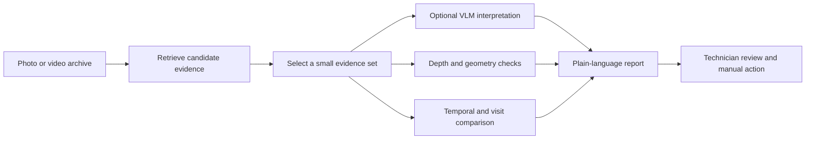

# The role and limits of a VLM in Visual Memory Lab

This document explains why Visual Memory Lab uses a vision-language model (VLM),
what the VLM can and cannot safely do, and why it is only one part of an
inspection assistant.

It is written in two layers:

1. a practical explanation for a technician who does not work with software or
   AI;
2. an engineering explanation of retrieval, memory, geometry, time, evidence,
   cost, and failure handling.

The main idea is simple:

> The VLM helps read and explain selected evidence. It does not replace the
> memory system, measurement system, inspection history, or technician.

## 1. The practical problem

Imagine a technician checking an office or facility after a service call. They
take a photograph or review a camera recording and ask:

- “Was this workstation already inspected?”
- “When did someone open the cabinet?”
- “Is the walkway blocked?”
- “Did the toolbox move?”
- “Does this current view show the same area as the earlier one?”

The technician does not really want a generic description such as:

> “There is a desk, a chair, and two monitors.”

They want a useful inspection answer tied to evidence:

> “The earlier and current views both show the two-monitor workstation. The
> desk surface is visible in both images, but the camera angles differ, so the
> images do not by themselves prove that every object stayed in the same place.
> Check the cable routing and monitor power on site.”

That answer requires more than looking at one image. It requires finding the
right earlier evidence, comparing views, understanding what is visible, and
stating what remains uncertain.

## 2. What a VLM is in this application

A VLM combines visual input and language. In simplified form:

```text
image or video + question → visual-language interpretation
```

In Visual Memory Lab, the VLM may be asked to:

- describe a selected inspection image;
- describe a selected video window;
- compare selected earlier and current views;
- summarize visible objects and conditions;
- explain which visible details support an answer;
- recommend a manual check when the evidence is incomplete.

The important word is **selected**. The VLM is normally called after the local
system has retrieved a small evidence set. It is not expected to inspect every
image in the archive for every question.

The current office application treats VLM analysis as an explicit analysis
action. A technician or reviewer selects evidence, then asks for a bounded
summary or report. VLM output is cached and labelled as supporting analysis,
not human ground truth.

The current Charades video branch uses the dataset's official action labels and
time intervals for its baseline. It does not yet use VLM-generated captions as
the source of truth.

## 3. What the VLM can do

### Describe visible objects and conditions

Technician question:

> “What is visible on this workstation?”

Possible VLM response:

> “Two monitors, a keyboard, a mouse, loose papers, cables, a telephone, and an
> office chair are visible.”

The evidence is the selected image. The VLM can describe what appears in that
image, subject to image quality and occlusion.

It cannot prove that an object is present outside the visible area.

### Summarize a selected inspection

Technician question:

> “What should I check at this workstation?”

Possible VLM response:

> “The desk surface is cluttered with papers and cables. Check cable routing,
> monitor power, and whether the clutter affects access to the workstation.”

This is useful because it turns visual evidence into a practical checklist. It
is still a recommendation based on the image, not a measurement of electrical
or mechanical safety.

### Explain a comparison

Technician question:

> “What differs between the current and earlier views?”

Possible VLM response:

> “The chair appears in a different position and the desk surface has a
> different arrangement of papers. The viewpoints are not identical, so these
> are items to verify rather than confirmed movements.”

The VLM can explain a selected comparison in ordinary language. The comparison
system must still provide the two images, visit order, and any geometric evidence.

### Describe a video window

Technician question:

> “What happens in this four-second clip?”

Possible VLM response:

> “A person reaches toward the cabinet and opens its door.”

This can make a retrieved video window easier to review. It does not automatically
give precise action boundaries unless the system separately measures them.

## 4. What the VLM cannot safely do by itself

A VLM alone cannot reliably provide the complete inspection workflow.

It cannot:

- search an entire archive efficiently and consistently;
- remember every previous inspection unless a memory system stores it;
- prove that two similar-looking objects are the same persistent object;
- measure reliable distance from an ordinary RGB image alone;
- distinguish camera movement from real-world movement in every case;
- know the calendar date when the dataset does not contain it;
- interpret an unseen object as definitely absent;
- guarantee that a confident sentence is correct;
- prove that equipment is safe, powered, stable, or operational;
- replace an on-site maintenance or safety check.

The distinction is:

```text
VLM:
    “What does this selected evidence appear to show?”

Memory system:
    “Which evidence should we inspect?”

Geometry:
    “Where is it, and how far did it move?”

Technician:
    “Is the equipment safe and operational?”
```

## 5. Why a VLM is necessary but not sufficient

The application combines several responsibilities:



The VLM is necessary because the user asks questions in natural language and
the final explanation should be understandable. But the other components are
necessary because:

- retrieval finds evidence across many memories;
- memory preserves history and provenance;
- geometry supports physical measurement;
- temporal processing locates actions in a recording;
- the technician decides what should happen in the real world.

## 6. Engineering reasons a VLM alone is insufficient

### 6.1 Retrieval scale

Suppose an archive has (N) images or video windows. Sending every item to a
cloud VLM requires approximately:

$$
N \times \text{VLM calls per item}.
$$

That becomes expensive and slow as the archive grows.

Visual Memory Lab first uses local embeddings and vector search to select a small
candidate set:

```text
many memories → cheap local retrieval → a few candidates → VLM review
```

This gives the VLM a focused evidence set instead of asking it to act as the
entire search engine.

### 6.2 Memory and persistence

A VLM request is normally a single interaction. It does not automatically retain
an auditable history of every inspection.

The memory system stores records such as:

```text
embedding
image/video identifier
timestamp or logical visit
sequence and frame information
place zone
camera pose when available
object evidence
source path
```

This allows the system to answer “show me the earlier view” instead of asking a
VLM to guess what happened in the past.

### 6.3 Temporal precision

A VLM may correctly summarize a four-second clip while being vague about the
exact moment. If the true action occupies interval (I_{\text{true}}) and the
retrieved interval is (I_{\text{pred}}), temporal overlap can be measured as:

$$
\operatorname{IoU}_t =
\frac{|I_{\text{pred}} \cap I_{\text{true}}|}
     {|I_{\text{pred}} \cup I_{\text{true}}|}.
$$

The VLM's sentence is useful interpretation. The temporal memory and evaluation
pipeline are responsible for measuring whether the returned time window actually
contains the event.

### 6.4 Geometry and physical measurement

A caption cannot, by itself, establish metric displacement. If a point on an
object has an earlier room-frame position (p_{\text{earlier}}) and a current
position (p_{\text{current}}), its displacement is:

$$
d =
\left\|
p_{\text{current}} - p_{\text{earlier}}
\right\|_2.
$$

For example:

```text
Earlier toolbox position: (x₁, y₁, z₁)
Current toolbox position:  (x₂, y₂, z₂)

displacement =
√[(x₂-x₁)² + (y₂-y₁)² + (z₂-z₁)²]
```

That requires depth, point clouds, camera calibration, recorded transforms, or
another geometric measurement process. The VLM may explain the result, but it
does not create reliable metric geometry from a sentence.

### 6.5 Evidence coverage

If the VLM does not see a wrench, several explanations are possible:

```text
the wrench is absent
the wrench is behind another object
the camera points elsewhere
the image is too blurry
the detector missed it
```

Therefore:

> “Not visible in this image” is not the same as “not present in the room.”

The application must preserve coverage and image-quality limitations so that the
VLM does not turn missing evidence into a confident absence claim.

### 6.6 Reproducibility and auditability

For an inspection report, the system should retain:

- original image or video identifiers;
- selected evidence identifiers;
- question and normalized search text;
- model name and revision;
- prompt or analysis configuration;
- cached VLM response;
- evidence strength and limitations;
- recommended manual check.

Without these records, a later reviewer cannot tell whether a conclusion came
from the original evidence, a changed prompt, or an unrelated model response.

### 6.7 Cost, privacy, and latency

The recommended architecture sends only selected evidence to a cloud VLM when
possible. This reduces:

- API calls;
- response latency;
- operating cost;
- unnecessary exposure of office or facility images.

The ordinary retrieval path remains local. Cloud analysis is an explicit action,
not an invisible call for every page load.

## 7. VLM-generated captions versus official annotations

The project has two different kinds of text.

### Current Charades baseline

Charades provides official action labels, objects, descriptions, and time
intervals. Our preprocessing code converts those structured fields into a simple
window-level training sentence:

```text
Official action:  Eating a sandwich
Objects:          plate, sandwich, food

Template output:  A person is eating a sandwich.
```

This sentence is generated by deterministic project code, not by a VLM.

The official action and time interval remain the evaluation reference.

### Future VLM-caption option

A VLM could produce a richer caption for a selected window:

```text
A person appears to eat a sandwich while holding a plate near a shelf.
```

That may improve language retrieval, but it is not automatically more accurate.
A VLM could:

- hallucinate an object;
- confuse “holding” with “reaching for”;
- miss the exact start or end of the action;
- infer intent that is not visible;
- vary its wording across prompts or model versions.

The safer hybrid record is:

```json
{
  "official_actions": ["Eating a sandwich"],
  "official_times": [{"start": 4.2, "end": 11.5}],
  "objects": ["plate", "sandwich", "food"],
  "vlm_caption": "A person appears to eat a sandwich while holding a plate."
}
```

Official labels support evaluation. VLM captions enrich retrieval and explanation.
They should not silently replace the reference annotations.

## 8. Depth and 3D from a technician's perspective

Depth is not needed for every question.

For:

> “When did someone open the door?”

RGB video and temporal retrieval may be sufficient.

Depth becomes valuable for questions involving physical geometry:

- “Is the walkway blocked?”
- “How far did the toolbox move?”
- “Does the panel protrude beyond the safe area?”
- “Is there enough clearance around the machine?”
- “Is this the same physical area from another viewpoint?”

The current ETH Office evidence contains coloured point clouds and recorded
transforms. Those support approximate shared-room geometry. Charades provides RGB
video and action annotations, but not metric depth or camera poses.

The relationship is:

```text
RGB + depth → geometric evidence
VLM         → semantic interpretation
memory      → retrieval, history, and provenance
technician  → physical verification and decision
```

## 9. Component responsibilities

| Component | Main responsibility |
|---|---|
| CLIP/image embeddings | Fast visual retrieval |
| Temporal encoder | Ordered video-window representation |
| Vector index | Search across many memories |
| Place zones and pose | Location and viewpoint context |
| Detector and segmenter | Visible object regions |
| RGB-D and point clouds | Approximate physical geometry |
| VLM | Selected-evidence interpretation and report wording |
| SQLite/history | Inspection records and traceability |
| Technician | Final physical verification and action |

This division prevents one model from becoming an unexplained “magic answer”
generator.

## 10. Failure examples

The useful engineering pattern is:

```text
failure → likely cause → evidence → safe interpretation → next experiment
```

### VLM names the wrong object

```text
Failure: “The red toolbox is on the left.”
Cause: similar red object or poor viewpoint
Evidence: selected crop is blurry and the object is partly occluded
Safe interpretation: a red object is visible; toolbox identity is unconfirmed
Next experiment: retrieve more views and request a closer crop
```

### VLM reports an object as absent

```text
Failure: “The wrench is missing.”
Cause: the wrench is outside the visible area
Evidence: the image does not cover the full workbench
Safe interpretation: the wrench is not visible in this view
Next experiment: capture the remaining workbench area
```

### Similar workstation from the wrong area is retrieved

```text
Failure: visually similar desk is returned
Cause: perceptual aliasing
Evidence: RGB appearance matches, but zone or pose does not
Safe interpretation: appearance similarity is not location identity
Next experiment: add place-zone or pose filtering
```

### Correct place but wrong visit is retrieved

```text
Failure: the correct workstation is found, but the wrong inspection is shown
Cause: temporal ambiguity
Evidence: place retrieval succeeds; visit order does not
Safe interpretation: location retrieval worked, historical retrieval failed
Next experiment: add visit-aware ranking and explicit logical timestamps
```

### Camera movement looks like object movement

```text
Failure: chair appears to have moved
Cause: different camera viewpoint
Evidence: room geometry is not aligned and the chair is only partly visible
Safe interpretation: possible visual difference, not confirmed movement
Next experiment: compare more views and use shared-frame geometry
```

### VLM and geometry disagree

```text
Failure: VLM says “same chair,” while geometric evidence is far apart
Cause: incomplete coverage, reconstruction noise, or semantic mistake
Evidence: RGB appearance agrees but 3D support is weak
Safe interpretation: candidate correspondence is uncertain
Next experiment: inspect additional views and preserve both evidence sources
```

### Cloud analysis is unavailable

```text
Failure: VLM report cannot be generated
Cause: missing API key, network failure, rate limit, or privacy policy
Evidence: local retrieval artifacts are still available
Safe interpretation: evidence retrieval succeeded; language interpretation is unavailable
Next experiment: review the selected images manually or retry explicitly
```

## 11. Why build the project if a VLM can describe images?

A VLM is a powerful component, but a description is not a memory system.

The project is solving the surrounding problem:

```text
many images/videos
        ↓
structured temporal and spatial memory
        ↓
searchable representations
        ↓
relevant evidence retrieval
        ↓
timestamps, place context, and comparison
        ↓
optional VLM interpretation
        ↓
auditable technician report
```

The project is therefore about perception plus memory plus evidence handling.
The VLM makes the result understandable; the rest of the system makes the
result findable, measurable, repeatable, and safer to use.

## 12. Final summary for a technician

The simplest explanation is:

> The assistant first finds the photographs or video moments that may answer
> your question. A VLM can then read those selected images and explain what is
> visible. Depth and 3D can measure where things are and whether they moved.
> The assistant records the evidence and its limits. You still perform the
> physical check that determines whether the equipment is safe or needs work.

The operational flow is:

```text
retrieve → select evidence → interpret → measure → report → verify
```

That is why the VLM is necessary, but not sufficient.
