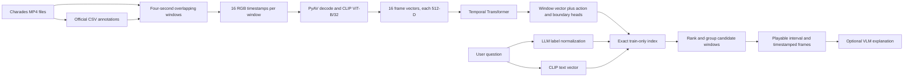
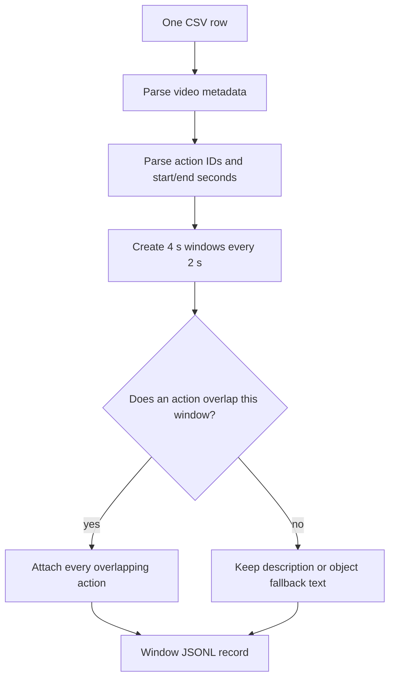
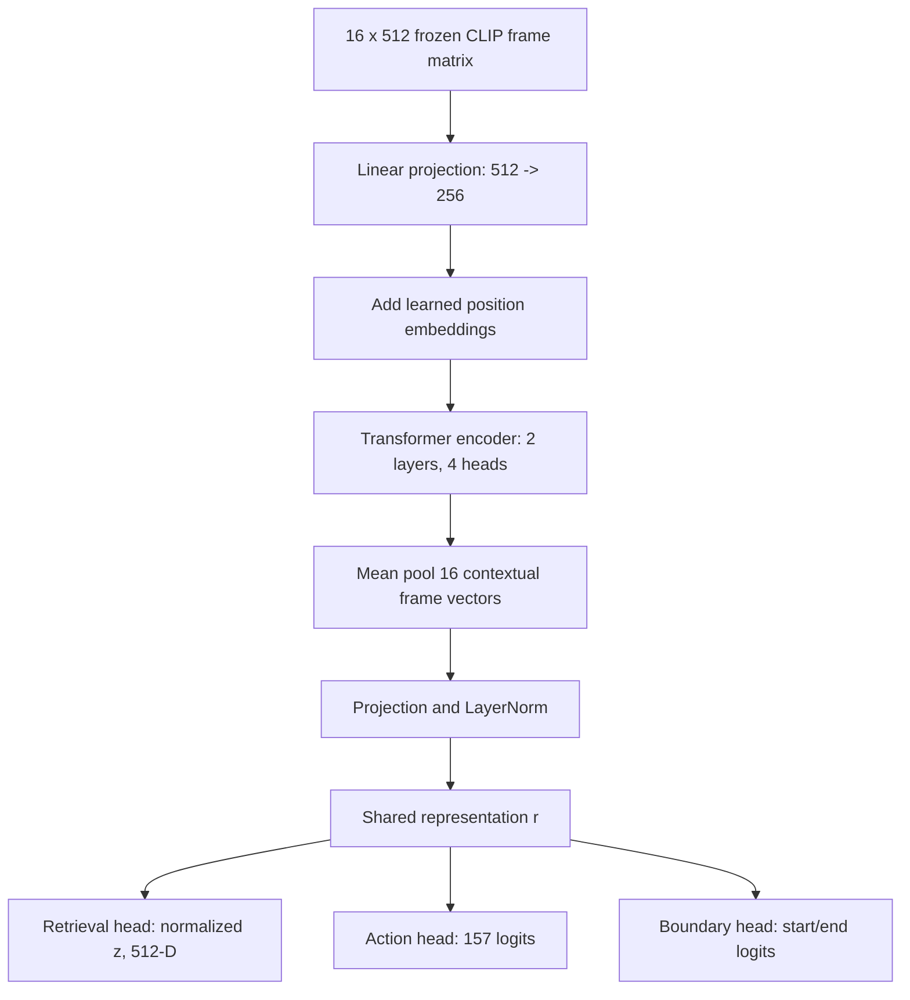
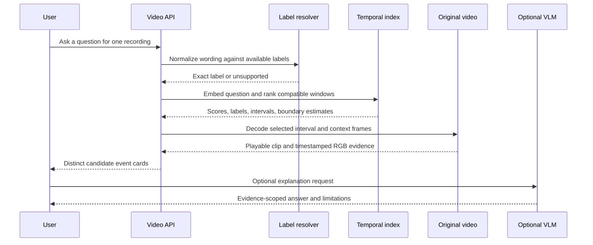

# Charades video memory: implementation, data contracts, and evaluation

This is the implementation-grounded reference for the Charades video-memory
pipeline. It answers four questions precisely:

1. What comes from the dataset, and how is it represented?
2. What is the input and output of each preparation and model stage?
3. How does a natural-language question become a timestamped result?
4. Which measurements tell us whether retrieval and localization worked?

The application goal is deliberately modest: a user asks about a recording and
receives a small set of playable time ranges. The answer remains tied to the
video and to the official annotations. A fluent explanation is not treated as
ground truth.

## 0. The whole system in one picture

There are two timelines in this project. The **offline timeline** prepares and
learns from the recordings. The **online timeline** answers one user question.
Keeping them separate matters: the expensive video decoding and CLIP encoding
should happen once, while a question should return quickly from saved vectors.



In plain language: the model does not search raw pixels every time the user
asks a question. It searches a memory of previously computed window vectors,
then returns the original video as evidence.

## 1. Source data and provenance

The local dataset is `data/Charades_v1_480`. Preparation code lives in
`src/visual_memory_lab/charades.py`; learned video preparation, training, and
evaluation live in `src/visual_memory_lab/learned_video.py`; the temporal model
is in `src/visual_memory_lab/temporal.py`.

The Charades CSV provides several different annotation sources. They are kept
separate rather than concatenated into one pseudo-caption:

| Source field | Meaning | How the pipeline uses it |
| --- | --- | --- |
| `id` | Recording identifier, for example `X226B` | Locates the MP4 and identifies evidence |
| `length` | Full recording duration in seconds | Builds valid time windows |
| `script` | One dataset-written summary/script | Recording context and UI display |
| `descriptions` | One or more dataset-written descriptions | Context text; not model-generated |
| `objects` | Video-level object list | Context and object hints; not per-frame truth |
| `actions` | Action class IDs plus start/end seconds | Window labels and evaluation reference |
| `split` | Official train or test assignment | Prevents train/test leakage |

An action string such as `c077 21.00 27.20` is parsed into an action ID and
interval, then mapped through `Charades_v1_classes.txt` to a name such as
`Putting a pillow somewhere`. The semicolon in `descriptions` separates
independent dataset descriptions. It does not indicate two retrieval passes,
and no VLM generated those sentences.

One prepared recording has this conceptual schema:

```text
video = {
  video_id, split, video_path, subject, scene, length_s,
  script, descriptions[], objects[],
  actions[{action_id, action_name, start_s, end_s}]
}
```

Objects are recording-level hints. If `laptop` is listed, that does not mean a
laptop is visible in every frame or every temporal window.

## 2. Window construction and labels

The preparation command first builds four-second windows with a two-second
stride. For recording duration $T$, window length $W=4$ and stride $S=2$:

$$
I_i = [s_i,e_i],\qquad
s_i=iS,\qquad e_i=\min(s_i+W,T).
$$

Thus a 30-second recording produces approximately $[0,4]$, $[2,6]$,
$[4,8]$, and so on. Windows overlap intentionally: an action crossing a
boundary can be represented in more than one window.

Action $A_k=[a_k,b_k]$ is attached to a window when the intervals overlap:

$$
b_k>s_i\quad\text{and}\quad a_k<e_i.
$$

This produces a multi-label problem. For example, if a window overlaps
`Holding a laptop` and `Someone is running somewhere`, both labels are valid;
neither is removed just because the other exists.

### Formula beside a video example

| Mathematical view | What the video looks like |
| --- | --- |
| Window $I_i=[2,6]$ | The player is showing seconds 2 through 6. |
| Action $A_1=[3,5]$ | The person holds a laptop from seconds 3 through 5. |
| Action $A_2=[4,7]$ | The person is also running from seconds 4 through 7. |
| $5>2$ and $3<6$ | `Holding a laptop` belongs to the window. |
| $7>2$ and $4<6$ | `Someone is running somewhere` also belongs to it. |
| Target $\mathbf{y}=[1,1,0,\ldots]$ | Two action entries are on at the same time. |

The labels are not saying that the whole four seconds are identical. They say
that the window contains evidence for those actions somewhere inside it. This
is why overlapping windows and later boundary estimation are necessary.

The preparation flow is:



Each window record contains:

```text
window = {
  video_id, split, start_s, end_s, actions[], objects[],
  description, text, timestamps_s[16]
}
```

The deterministic training text is made by `window_text`:

1. If structured action labels exist, use `A person is ...` followed by the
   action names.
2. Otherwise use the full recording description.
3. Otherwise use the object list.
4. Otherwise use a generic fallback.

This text is a stable CLIP target, not a generated caption. The original
`script`, descriptions, actions, and objects remain available as separate
metadata fields for display and audit.

### What becomes a label, and what does not?

| Item | Training/evaluation role | Example from a recording |
| --- | --- | --- |
| Action interval | Ground-truth event and time range | `Opening a closet/cabinet`, 9.5-17.0 s |
| Action name | Multi-label target and query vocabulary | `Holding a laptop` |
| Script/description | Context text and optional CLIP text target | “A person walks through a doorway...” |
| Object list | Recording-level context only | `laptop`, `doorway`, `vacuum` |
| VLM sentence | Optional post-retrieval explanation | “The laptop is visible near the doorway.” |

The last row is deliberately not used as temporal ground truth. A VLM may be
helpful for a human-readable explanation, but the official interval remains the
measurement reference.

## 3. RGB sampling and preprocessing

The current reference experiment uses 16 RGB samples per four-second window.
For a window $[s,e]$ and $F=16$ samples, timestamp $t_j$ is the center of its
equal sub-interval:

$$
t_j=s+\left(j+\frac{1}{2}\right)\frac{e-s}{F},
\qquad j=0,\ldots,F-1.
$$

For a full four-second window this is $0.125,0.375,\ldots,3.875$ seconds
after the window start. Sampling at sub-interval centers avoids repeatedly
using the exact boundary frame.

PyAV decodes the original MP4 at each timestamp. Each decoded RGB image is
passed through the Hugging Face preprocessing for `openai/clip-vit-base-patch32`:
resize/crop to the model's 224 by 224 input and convert pixels to the CLIP
normalized floating-point tensor. The image encoder is frozen and produces a
512-dimensional vector per frame:

$$
\mathbf{x}_{i,j}\in\mathbb{R}^{512},
\qquad X_i=[\mathbf{x}_{i,1},\ldots,\mathbf{x}_{i,16}]
\in\mathbb{R}^{16\times512}.
$$

The cache stores these arrays and the window metadata. It does not copy a new
video for each window. The reference cache is
`outputs/phase11/frames16/cache-v2` and records 18,994 windows from 1,300
videos, with no failed videos.


### Formula beside the video example

For the window from 2.0 to 6.0 seconds, $e-s=4$ and $F=16$:

| Math | Video interpretation |
| --- | --- |
| $t_0=2+(0.5)(4/16)=2.125$ | The first snapshot is just after 2 seconds. |
| $t_7=2+(7.5)(4/16)=3.875$ | The eighth snapshot is just before 4 seconds. |
| $t_{15}=2+(15.5)(4/16)=5.875$ | The last snapshot is just before 6 seconds. |
| $\mathbf{x}_{i,7}\in\mathbb{R}^{512}$ | CLIP's visual description of the frame at 3.875 s. |
| $X_i\in\mathbb{R}^{16\times512}$ | The complete ordered visual record for seconds 2-6. |

If a person reaches for a laptop at 2.5 seconds and leaves at 5.5 seconds,
the middle samples capture that progression. A single still image could miss
the reach; the ordered set gives the temporal model several chances to see it.

## 4. Temporal model: exact input and output contract

The trainable model receives one cached window tensor
$X_i\in\mathbb{R}^{16\times512}$. CLIP remains frozen. The temporal module is
`TemporalWindowEncoder`:

1. A learned linear projection maps each 512-vector to 256 dimensions.
2. A learned position embedding is added to preserve frame order.
3. Two Transformer encoder layers, each with four attention heads, exchange
   information between the 16 ordered frames.
4. The contextualized frame vectors are mean-pooled.
5. A projection and LayerNorm produce a normalized 512-dimensional window
   vector.

In plain language, the model does not read the original MP4 at training time.
The video-preparation step has already converted each sampled RGB frame into a
512-number CLIP vector. The temporal model receives those sixteen vectors in
their original time order. It learns how the vectors fit together as an event:
for example, a person approaches a door, reaches for a handle, and then walks
through it. The order matters; shuffling the vectors would remove the evidence
needed to distinguish an action from a static scene.

For one window, the contract is therefore:

```text
input:  float tensor [16, 512]
output: normalized retrieval vector [512]
        action logits [157]
        boundary logits [2]
```

The current training split contains 157 distinct action IDs. The number is a
property of this prepared subset, not a universal Charades constant.



In equations, the shared sequence representation is:

$$
\mathbf{h}_j=\mathbf{W}_{in}\mathbf{x}_j+\mathbf{b}_{in}+\mathbf{p}_j,
\qquad
H'=\mathrm{Transformer}(\mathbf{h}_1,\ldots,\mathbf{h}_{16}),
$$

$$
\mathbf{r}=\mathrm{LayerNorm}\left(
\mathbf{W}_{out}\frac{1}{16}\sum_{j=1}^{16}\mathbf{h}'_j
+\mathbf{b}_{out}\right).
$$

The original reference checkpoint has three heads. Phase 12 keeps those heads
and adds a fourth frame-evidence head; the equations for both versions are
shown below.

$$
\mathbf{z}=\mathrm{Normalize}(\mathbf{W}_r\mathbf{r}+\mathbf{b}_r),
\qquad
\hat{\mathbf{y}}=\mathbf{W}_a\mathbf{r}+\mathbf{b}_a,
\qquad
\hat{\mathbf{b}}=\sigma(\mathbf{W}_b\mathbf{r}+\mathbf{b}_b).
$$

Here **bold symbols are vectors**. $\mathbf{z}$ is used for retrieval,
$\hat{\mathbf{y}}$ is a 157-dimensional multi-label action prediction, and
$\hat{\mathbf{b}}=[\hat{u}_{start},\hat{u}_{end}]$ predicts normalized action
boundaries inside the current window.

The dimensions make the roles concrete:

| Quantity | Shape | Meaning |
| --- | --- | --- |
| $\mathbf{x}_j$ | $512$ | Frozen CLIP representation of one sampled RGB frame |
| $\mathbf{h}_j$ | $256$ | Internal contextual representation after projection and attention |
| $\mathbf{r}$ | $512$ | One representation for the whole four-second window |
| $\mathbf{z}$ | $512$ | Normalized vector inserted into the retrieval index |
| $\hat{\mathbf{y}}$ | $157$ | One score per action in this prepared training vocabulary |
| $\hat{\mathbf{b}}$ | $2$ | Predicted normalized start and end coordinates |

“Normalize” means divide a vector by its Euclidean length. For a vector
$\mathbf{v}$, $\mathrm{Normalize}(\mathbf{v})=\mathbf{v}/\|\mathbf{v}\|_2$.
This keeps retrieval focused on direction rather than raw magnitude, which is
why cosine similarity can compare the question vector and window vector.

Phase 12 also applies a frame-level head to each contextual vector:

$$
\mathbf{z}_{j}^{frame}=W_f\mathbf{h}_j+\mathbf{b}_f\in\mathbb{R}^{3}.
$$

After a sigmoid, its three values estimate (1) whether the frame is relevant
to the action, (2) whether it is close to the action start, and (3) whether it
is close to the action end. This head does not replace the pooled retrieval
vector. It answers a different question: “Where inside this already retrieved
window should a reviewer look?”

### Formula beside a technician-style video example

| Model operation | What it means for the video |
| --- | --- |
| $\mathbf{x}_1,\ldots,\mathbf{x}_{16}$ | Sixteen CLIP descriptions of a technician's ordered views. |
| $\mathbf{h}_j=\mathbf{W}_{in}\mathbf{x}_j+\mathbf{b}_{in}+\mathbf{p}_j$ | Put every frame into the model's working space and mark its position in time. |
| Transformer attention | Let the “reaching” frame use the later “holding” frame as context. |
| $\frac{1}{16}\sum_j\mathbf{h}'_j$ | Summarize the entire four-second inspection moment. |
| $\mathbf{z}$ | One searchable memory for “reach, hold, and turn away.” |
| $\hat{\mathbf{y}}$ | Scores actions such as `Holding a laptop` or `Running`. |
| $\hat{\mathbf{b}}$ | Estimates where the action starts and ends inside this window. |

The temporal model is not a detector. It does not draw a box around a laptop.
It learns a compact representation of the ordered event and provides auxiliary
action and boundary predictions that can improve ranking and localization.

For a technician-style example, suppose a four-second window covers a person
walking toward a workstation, picking up a laptop, and leaving. The pooled
vector lets a text query such as “when did someone pick up a laptop?” find this
window. The action head can keep both `Holding a laptop` and `Someone is
running somewhere` active if both overlap. The boundary head gives a coarse
location inside the window, while the Phase 12 frame head identifies which
sampled frames are closest to the pickup start and end. None of these outputs
creates an object identity or proves that a particular laptop was tracked over
time.

## 5. Target preparation and loss

For each window, the action target is a 157-dimensional multi-hot vector
$\mathbf{y}$. If `Holding a laptop` and `Someone is running somewhere` overlap
the window, both corresponding entries of $\mathbf{y}$ equal 1.

This is deliberately **multi-label**, not single-class classification. A
four-second slice may intersect several official action intervals. The target
sets every intersecting action entry to one and leaves the others at zero. For
example, if a window overlaps `Holding a laptop` and `Someone is running
somewhere` but not `Opening a door`, then both first labels are one and the
door label is zero. The model is allowed to predict both active actions.

For the action with the greatest overlap, the boundary target is normalized
relative to the window:

$$
\mathbf{b}=
\left[
\mathrm{clip}\left(\frac{a_k-s_i}{e_i-s_i},0,1\right),
\mathrm{clip}\left(\frac{b_k-s_i}{e_i-s_i},0,1\right)
\right].
$$

Example: an annotated action from 1.0 to 3.0 seconds inside a window from 0.0
to 4.0 seconds has target $\mathbf{b}=[0.25,0.75]$. A window can have action
labels without a boundary target when no suitable single action interval is
available; the reference run has 13,567 boundary-labelled training windows.

The `clip` operation handles actions that cross a window edge. An annotation
from $-1.0$ to $5.0$ seconds viewed through a $0.0$--$4.0$ second window becomes
$[0,1]$: the action is already in progress at the beginning and still present
at the end, so this window cannot learn boundaries outside its own range.

### Formula beside a video example

Imagine the window is 0.0-4.0 seconds and the annotation says:
`Holding a laptop` from 1.0-3.0 seconds.

| Target | Calculation | Meaning |
| --- | --- | --- |
| Start | $(1.0-0.0)/(4.0-0.0)=0.25$ | The action begins one quarter of the way through the window. |
| End | $(3.0-0.0)/(4.0-0.0)=0.75$ | The action ends three quarters of the way through the window. |
| $\mathbf{b}$ | $[0.25,0.75]$ | The model should point to seconds 1-3, not claim the whole window. |

At inference time, convert normalized coordinates back to seconds:

$$
\widehat{a}=s_i+\hat{u}_{start}(e_i-s_i),
\qquad
\widehat{b}=s_i+\hat{u}_{end}(e_i-s_i).
$$

So a prediction of $[0.25,0.75]$ for a 2.0-6.0 second window becomes
3.0-5.0 seconds in the original video.

The objective combines three terms:

$$
\mathcal{L}=\mathcal{L}_{retrieval}
+\lambda_a\mathcal{L}_{action}
+\lambda_b\mathcal{L}_{boundary}.
$$

The retrieval term is symmetric contrastive loss between normalized temporal
vectors and normalized CLIP text vectors. The action term is multi-label binary
cross-entropy. The boundary term is Smooth L1 between the predicted sigmoid
coordinates and $\mathbf{b}$. The reference run uses
$\lambda_a=1.0$ and $\lambda_b=2.0$.

### What each loss means

These are not four interchangeable versions of “error.” Each term supervises a
different output of the model.

#### 1. Retrieval loss: symmetric contrastive cross-entropy

For a batch of $B$ windows, let $\mathbf{z}_i$ be the learned video-window
vector and $\mathbf{q}_i$ be the CLIP text vector describing the same window.
Both are normalized before comparison. The similarity matrix is:

$$
S_{ij}=\frac{\mathbf{z}_i^{\mathsf{T}}\mathbf{q}_j}{\tau},
$$

where $\tau$ is a temperature, currently $0.07$. The correct match for row
$i$ is column $i$. Cross-entropy over each row is:

$$
\mathcal{L}_{video\rightarrow text}
=-\frac{1}{B}\sum_{i=1}^{B}\log
\frac{\exp(S_{ii})}{\sum_{j=1}^{B}\exp(S_{ij})}.
$$

The implementation also transposes the matrix and performs the reverse
text-to-video calculation. The retrieval loss is their average:

$$
\mathcal{L}_{retrieval}
=\frac{1}{2}\left(\mathcal{L}_{video\rightarrow text}
+\mathcal{L}_{text\rightarrow video}\right).
$$

In the technician example, the positive pair might be a window showing a
person picking up a laptop and the text “holding a laptop.” Other windows in
the batch are negatives for that pair. A lower loss means the matching window
and text are more distinguishable from the other batch entries. It does not
measure the accuracy of the timestamp boundaries.

#### 2. Action loss: multi-label binary cross-entropy with logits

The action head produces one raw logit $\hat{y}_c$ for every action class. A
logit is an unrestricted real number; the sigmoid converts it to a probability
$p_c=\sigma(\hat{y}_c)$. For target $y_c\in\{0,1\}$, the binary cross-entropy
for one class is:

$$
\ell_{BCE}(y_c,p_c)
=-\left[y_c\log(p_c)+(1-y_c)\log(1-p_c)\right].
$$

The implementation uses the numerically stable “with logits” form directly on
$\hat{y}_c$, then averages over the 157 classes and the batch. This is
multi-label BCE, not softmax cross-entropy: several actions can be correct in
the same window. If a person is both holding a laptop and running, both target
entries are one and the model is rewarded for assigning high probabilities to
both.

#### 3. Boundary loss: Smooth L1 regression

The boundary head predicts two normalized coordinates after a sigmoid:
$\hat{\mathbf{b}}=[\hat{u}_{start},\hat{u}_{end}]$. For each coordinate error
$d=\hat{b}-b$, Smooth L1 uses:

$$
\mathrm{smoothL1}(d)=
\begin{cases}
\frac{1}{2}d^2, & |d|<1,\\
|d|-\frac{1}{2}, & |d|\ge 1.
\end{cases}
$$

Small mistakes are quadratic, encouraging precise fitting. Large mistakes grow
linearly, so one badly localized window does not dominate the whole batch as
strongly as squared error would. A prediction of $[0.30,0.70]$ against target
$[0.25,0.75]$ is a small boundary error; it maps to a small timestamp shift
after conversion back to seconds.

#### 4. Frame-refinement loss: frame-wise binary cross-entropy

Phase 12 applies BCE-with-logits to the three frame channels (relevance, start,
and end) for every sampled timestamp. It uses the same mathematical BCE form
as the action loss, but the indexing is different: action BCE asks which action
classes are present in the window, while frame BCE asks which views inside that
window support the action and its boundaries. A frame mask prevents padded or
invalid frame positions from contributing to the loss.

### Why the weights matter

The total loss is a weighted sum, so $\lambda_a$ and $\lambda_b$ control the
relative influence of auxiliary supervision. With $\lambda_a=1$ and
$\lambda_b=2$, a unit of boundary-related loss contributes twice as much as a
unit of action loss. This is a training choice, not a probability calibration.
The loss values cannot be compared directly across different terms because the
terms have different targets and scales; final retrieval and temporal metrics
must be measured separately.

Phase 12 adds frame-level supervision to this reference objective:

$$
\mathcal{L}_{phase12}=\mathcal{L}_{retrieval}
+\lambda_a\mathcal{L}_{action}
+\lambda_b\left(\mathcal{L}_{boundary}+\mathcal{L}_{frame}\right).
$$

For each sampled timestamp $t_j$, the frame target has three entries:

| Channel | Target rule | Video interpretation |
| --- | --- | --- |
| Relevance | $1$ when $t_j$ lies inside the selected action interval | This frame is part of the laptop pickup |
| Start | $1$ for the sampled frame closest to the action start | The first useful view near the pickup |
| End | $1$ for the sampled frame closest to the action end | The last useful view near the pickup |

The frame loss is binary cross-entropy with logits. It is an additional
localization signal, not a new source of labels: the official Charades interval
still supplies the supervision. Usually many frames are relevant, but only one
sampled frame is selected as the closest start and one as the closest end.

### One complete worked example

Use one four-second training window as the running example:

```text
window:     0.0 s ------------------------------ 4.0 s
action:           Holding a laptop
              1.0 s ---------------- 3.0 s
```

The same window participates in all loss terms, but each term asks a different
question.

#### Retrieval loss for this window

Assume a batch contains four windows. The text paired with this window is
“holding a laptop.” The temporal model produces the window vector
$\mathbf{z}_1$ and CLIP produces the text vector $\mathbf{q}_1$. The other
three text vectors in the batch, $\mathbf{q}_2,\mathbf{q}_3,\mathbf{q}_4$,
describe other windows.

The row of similarities is:

$$
[S_{11},S_{12},S_{13},S_{14}]
=\frac{1}{\tau}
[\mathbf{z}_1^{\mathsf{T}}\mathbf{q}_1,
\mathbf{z}_1^{\mathsf{T}}\mathbf{q}_2,
\mathbf{z}_1^{\mathsf{T}}\mathbf{q}_3,
\mathbf{z}_1^{\mathsf{T}}\mathbf{q}_4].
$$

The correct column is $1$. Retrieval loss rewards the model when the laptop
window is closer to “holding a laptop” than to the other batch descriptions.
It does **not** check whether the model localized the action to 1--3 seconds;
the whole four-second window is treated as the retrieval unit here.

#### Action loss for this window

Suppose the prepared action vocabulary contains:

```text
class 12: Holding a laptop
class 37: Someone is running somewhere
class 91: Opening a door
```

If only `Holding a laptop` overlaps this particular window, the relevant target
entries are:

$$
y_{12}=1,\qquad y_{37}=0,\qquad y_{91}=0.
$$

If the model's sigmoid probabilities are $[0.90,0.20,0.05]$, the BCE terms
reward the high probability for laptop holding and penalize the false positive
probabilities for running and opening a door. If running also overlapped the
same 0--4 second window, then $y_{37}$ would also be $1$; this is why the loss
is multi-label rather than softmax classification.

#### Boundary loss for this window

The official interval 1--3 seconds becomes:

$$
\mathbf{b}
=\left[\frac{1-0}{4-0},\frac{3-0}{4-0}\right]
=[0.25,0.75].
$$

Suppose the boundary head predicts $\hat{\mathbf{b}}=[0.30,0.70]$. The errors
are $d_{start}=0.05$ and $d_{end}=-0.05$. Smooth L1 gives a small penalty for
both errors. Converting the prediction back to seconds gives:

$$
\hat{a}=0+0.30(4)=1.2\text{ s},\qquad
\hat{b}=0+0.70(4)=2.8\text{ s}.
$$

Thus this term asks: “Did the model place the action near 1--3 seconds inside
the retrieved window?”

#### Frame-refinement loss for this window

With eight illustrative samples at $[0.25,0.75,1.25,1.75,2.25,2.75,3.25,3.75]$
seconds, the relevance target is one for the samples inside 1--3 seconds:

$$
\mathbf{y}^{relevance}=[0,0,1,1,1,1,0,0].
$$

The sample closest to 1.0 seconds is 1.25 seconds, so the start channel marks
that frame. The sample closest to 3.0 seconds is 2.75 seconds, so the end
channel marks that frame:

$$
\mathbf{y}^{start}=[0,0,1,0,0,0,0,0],\qquad
\mathbf{y}^{end}=[0,0,0,0,0,1,0,0].
$$

This term is more specific than the pooled boundary term. It tells the model
which observed views support the interval, while the boundary term only sees
two numbers for the entire window. The frame head still cannot see hidden
frames between samples or prove object identity; it only refines evidence at
the sampled timestamps.

In short, for this one window:

| Loss | What it measures in the example |
| --- | --- |
| Retrieval | Whether this four-second window matches the text “holding a laptop” |
| Action | Whether laptop holding and any overlapping actions are present |
| Boundary | Whether the action lies near 1.0--3.0 seconds |
| Frame refinement | Which sampled views support the action start, body, and end |

The model has 1,929,119 trainable parameters. The reference three-epoch CUDA
run produced:

```text
epoch 1: total 3.2478 | retrieval 2.4475 | action 0.6209 | boundary 0.0897
epoch 2: total 2.3197 | retrieval 1.7432 | action 0.4637 | boundary 0.0564
epoch 3: total 1.7963 | retrieval 1.3761 | action 0.3477 | boundary 0.0363
```

These are optimization diagnostics, not evidence that timestamps are accurate.

The three losses answer different questions:

| Loss | Question being trained | Technician interpretation |
| --- | --- | --- |
| Retrieval | Is this window related to the text description? | “Does this short clip look like the requested event?” |
| Action | Which official actions occur in the window? | “Is laptop-holding present, even if running is present too?” |
| Boundary | Where inside the window is the strongest action interval? | “Which part should the technician inspect first?” |

The Phase 12 frame-refinement loss adds a fourth diagnostic. It asks which
individual sampled views support the action and its boundaries. A low frame
loss means the head fits the interval-derived frame labels; it does not by
itself prove that the real-world action is visually unambiguous.

## 6. Online retrieval and answer flow

The user-facing path is:

```text
question
  -> CLIP text embedding \mathbf{q}
  -> optional text-only LLM maps wording to exact available action labels
  -> filter to supported labels in the selected recording
  -> search learned temporal vectors
  -> boundary-aware temporal reranking
  -> group overlapping windows into distinct events
  -> show RGB frames, timestamps, and playable evidence
  -> optional VLM explanation scoped to selected evidence
```

The LLM is a label-normalization aid, not an evidence source. It may map
“when did they carry the laptop?” to the exact supplied label `Holding a laptop`.
If no supplied action is compatible, the application returns a safe no-result;
it does not substitute a nearby cabinet or clothing action.

With normalized vectors, the retrieval score for query **q** and stored window
**z**$_i$ is cosine similarity:

$$
s_i=\cos(\mathbf{q},\mathbf{z}_i)
=\mathbf{q}^{\mathsf{T}}\mathbf{z}_i,
\qquad
\lVert\mathbf{q}\rVert_2=\lVert\mathbf{z}_i\rVert_2=1.
$$

The current index uses exact dot-product search over the 14,824 train windows.
The browser then plays the original MP4 using the selected interval. Overlap
grouping changes the displayed list, not the stored vectors or annotations.

The VLM is invoked only after retrieval. It receives timestamped RGB frames and
the selected event metadata, and can say that an event is supported, partially
visible, unclear, or not visibly confirmed. It cannot repair a bad retrieval or
turn a video-level object list into frame-level truth.

### Formula beside the user flow

| Step | Math or data operation | What the user sees |
| --- | --- | --- |
| Ask | Text question becomes **q** | “When did someone carry a laptop?” |
| Search | $s_i=\mathbf{q}^{\mathsf{T}}\mathbf{z}_i$ | Candidate windows ranked by compatibility. |
| Restrict | Keep windows with the normalized action label | Unrelated cabinet clips are rejected. |
| Refine | Apply predicted $\hat{\mathbf{b}}$ | A narrower event interval is proposed. |
| Group | Merge intervals with substantial time overlap | One event card instead of five duplicate cards. |
| Explain | VLM sees selected timestamped frames only | A readable answer with visible limitations. |

The full online flow is easier to audit when drawn as a sequence:



The LLM in this diagram can clarify that “carry a laptop” is close to the
supplied action label `Holding a laptop`. It cannot create a new timestamp. The
timestamp comes from the stored annotation, the learned boundary prediction,
and the original playable video.

## 7. Evaluation and what the numbers mean

The held-out evaluation used 4,170 test queries and the matching 16-frame
manifest. A query is correct for retrieval when a returned window shares an
official action label and overlaps its official interval.

For a predicted interval $P=[p_s,p_e]$ and official interval
$G=[g_s,g_e]$, temporal intersection-over-union is:

$$
\mathrm{IoU}(P,G)=
\frac{\max(0,\min(p_e,g_e)-\max(p_s,g_s))}
{\max(p_e,g_e)-\min(p_s,g_s)}.
$$

| Formula | Video example |
| --- | --- |
| $G=[10,14]$ | The official annotation says the action lasts from 10 to 14 s. |
| $P=[9,13]$ | The system returns a clip from 9 to 13 s. |
| Intersection $=[10,13]$ | Three seconds agree. |
| Union $=[9,14]$ | Five seconds are covered by either interval. |
| $\mathrm{IoU}=3/5=0.60$ | The result overlaps well, but it starts too early. |

Recall@k asks a different question: among the first $k$ returned cards, did at
least one have the right label and overlap the official interval? This is why a
system can have high Recall@10 while still having modest temporal IoU: it often
finds the right event somewhere in ten candidates, but does not yet place it
tightly in time.

| Metric | Result | Interpretation |
| --- | ---: | --- |
| Recall@1 | 0.6604 | Correct event appears first 66.04% of the time |
| Recall@5 | 0.9070 | Correct event appears in five candidates 90.70% of the time |
| Recall@10 | 0.9326 | Correct event appears in ten candidates 93.26% of the time |
| Mean temporal IoU | 0.2606 | Retrieved time ranges are still coarse |
| Median temporal IoU | 0.2010 | Typical overlap is lower than the recall suggests |
| Mean boundary error | 7.305 s | Absolute start/end error summary; large values reflect broad windows and fallback cases |
| Mean normalized boundary error | 0.5710 | Error relative to the annotated interval scale |
| Duplicate rate | 0.1753 | Fraction of displayed candidates that repeat an overlapping moment |
| Misses | 281 / 4,170 | No top-k candidate met the label-and-overlap criterion |

The important engineering conclusion is that the model retrieves the right
event family fairly well at top-k, but temporal localization is not yet precise.
Recall is therefore not a timestamp guarantee. The files are:

```text
outputs/phase11/frames16/cache-v2/summary.json
outputs/phase11/frames16/training/summary.json
outputs/phase11/frames16/evaluation/metrics.json
outputs/phase11/frames16/evaluation/report.md
```

## 8. Reproduce the reference run

```powershell
uv run visual-memory-lab build-charades-frames `
  --manifest outputs/charades/learned/windows/windows.jsonl `
  --output outputs/phase11/frames16 `
  --frames-per-window 16

uv run visual-memory-lab build-charades-video-cache `
  --manifest outputs/phase11/frames16/frames.jsonl `
  --output outputs/phase11/frames16/cache-v2 `
  --device auto --workers 4 --batch-size 16

uv run visual-memory-lab train-charades-video `
  --cache outputs/phase11/frames16/cache-v2 `
  --output outputs/phase11/frames16/training `
  --device auto --boundary-weight 2.0 --action-weight 1.0

uv run visual-memory-lab index-charades-video `
  --cache outputs/phase11/frames16/cache-v2 `
  --checkpoint outputs/phase11/frames16/training/temporal_multitask.pt `
  --output outputs/phase11/frames16/index --device auto --split train

uv run visual-memory-lab evaluate-charades-video `
  --index outputs/phase11/frames16/index `
  --test-manifest outputs/phase11/frames16/frames.jsonl `
  --output outputs/phase11/frames16/evaluation --device auto
```

The earlier `outputs/charades/learned` and `outputs/phase11` artifacts used
eight-frame windows and remain as historical comparisons. The 16-frame
`frames16` run is the current reference for future experiments.

## 9. Worked technician interpretation

Suppose a maintenance recording contains a person running through a doorway
with a laptop. A user asks, “When did someone carry the laptop through the
door?” The system may normalize this to `Holding a laptop` plus a nearby doorway
relation, retrieve a window, and show its annotated interval and context.

The technician can inspect the frames and playback. If the laptop is visible in
only two frames, the correct result is “partially visible,” not a confident
claim that an identified laptop was tracked. If the recording has no compatible
action, the correct result is “no matching annotated event was found.” This
separation between dataset label, learned retrieval, visual review, and final
wording is the main reliability boundary of the application.

## 10. Current boundaries

This reference system does not yet provide persistent object identity, depth,
audio understanding, true frame-level segmentation, or production-grade event
boundaries. Those are separate extensions. The current contribution is a
reproducible path from official video annotations to learned temporal retrieval,
with explicit tensor contracts, evidence provenance, and held-out metrics.

## 11. Phase 12: frame-level temporal evidence

The earlier three-head model predicted one start and one end value from the
pooled four-second window. Phase 12 adds a small evidence head to the same
temporal encoder. CLIP remains frozen; only the temporal model is trained.

For each sampled frame embedding $\mathbf{x}_{i,j}$, the encoder produces a
hidden vector $\mathbf{h}_{i,j}$. A linear head predicts relevance, start
proximity, and end proximity:

$$
\mathbf{z}_{i,j}=W_f\mathbf{h}_{i,j}+\mathbf{b}_f\in\mathbb{R}^3.
$$

The labels come from the official action interval. A frame inside the interval
gets relevance label $1$; the closest sampled frame to each boundary gets the
corresponding boundary label $1$. The extra loss is:

$$
\mathcal{L}_{frame}=\mathrm{BCEWithLogits}(\mathbf{z},\mathbf{y}).
$$

The Phase 12 objective is:

$$
\mathcal{L}=\mathcal{L}_{retrieval}+\lambda_a\mathcal{L}_{action}
+\lambda_b(\mathcal{L}_{boundary}+\mathcal{L}_{frame}).
$$

At indexing time, frame probabilities become timestamps using weighted
averages. If $p^s_j$ and $p^e_j$ are the start and end probabilities at
timestamp $t_j$:

$$
\hat{s}=\frac{\sum_jt_jp^s_j}{\sum_jp^s_j},\qquad
\hat{e}=\frac{\sum_jt_jp^e_j}{\sum_jp^e_j}.
$$

The estimates are clamped to the retrieved window. If they are invalid, the
pooled boundary estimate is retained. This is interval refinement, not object
tracking and not proof that every frame visibly proves the action.

The UI keeps three intervals separate:

| Field | Meaning |
| --- | --- |
| Matched action interval | The refined interval used for review |
| Dataset annotation | The official Charades interval used for supervision |
| Context shown | A padded playable interval, currently two seconds on either side |

For example, “holding a laptop” may produce a refined interval of $0.8$--$6.9$
seconds, an official annotation of $0.6$--$7.8$ seconds, and a context clip of
$0.0$--$9.8$ seconds. The user can distinguish the model’s localization from
the annotation and from extra playback context. The index also stores sampled
timestamps and refinement confidence for later frame-strip review.

Phase 12 does not add audio, depth, persistent object identity, or VLM-generated
labels. It improves temporal evidence while preserving the frozen-CLIP baseline
for comparison.

### Phase 12 status and metrics

The Phase 12 training job, refined index, and held-out evaluation have now been
generated on CUDA. The artifacts are:

```text
outputs/phase12/frames16/training/summary.json
outputs/phase12/frames16/training/history.jsonl
outputs/phase12/frames16/index/summary.json
outputs/phase12/frames16/evaluation/metrics.json
```

The same 4,170 held-out queries were used for the comparison:

| Metric | Phase 11 baseline | Phase 12 refinement |
| --- | ---: | ---: |
| Recall@1 | 0.6604 | 0.6568 |
| Recall@5 | 0.9070 | 0.8959 |
| Recall@10 | 0.9326 | 0.9259 |
| Mean temporal IoU | 0.2606 | 0.2605 |
| Mean boundary error | 7.305 s | 7.191 s |
| Mean duplicate rate | 0.1753 | 0.1707 |
| Misses | 281 | 309 |

The first run does not improve retrieval recall: Recall@10 decreases by about
0.67 percentage points. Mean boundary error improves by about 0.11 seconds and
duplicate rate decreases, but the temporal-IoU change is negligible. This is a
useful result rather than a failure hidden by the UI: the new frame head is
implemented and measurable, but it is not yet a clear improvement over the
baseline. The next experiment should tune its loss weighting or compare the
refined interval against the pooled boundary interval more directly.

The training summary reports 1,929,890 trainable parameters, 13,567 windows with
boundary and frame labels, and three CUDA epochs. The correct claim is:

> Phase 12 adds a tested frame-level temporal refinement method. On the first
> 4,170-query evaluation, it slightly improves boundary error but does not yet
> improve retrieval recall or temporal IoU.
