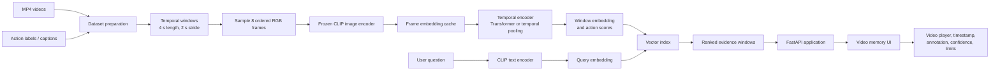

# Phase 10 — Learned video memory: application, architecture, and mathematics

This document describes the next version of Visual Memory Lab: a system that can
search a collection of videos for a **moment**, not just for a similar still
image. It is written from the application outward. The research components are
there to make the application reliable and measurable.

The running example is an inspection assistant. A technician may have hours of
camera footage and ask:

> “When did the person open the cabinet?”

or:

> “Show the last time the operator picked up the drill.”

The system should return a short, playable time window and explain why that
window was selected. It should not claim that an event never happened merely
because retrieval found no result.

## 1. What the system is trying to do

The input is a video collection and, when available, weak supervision such as
action annotations or captions. The output is an ordered list of evidence
windows:

```text
question → likely time window → playable video evidence → explanation and limits
```

For an office or factory this can support:

- finding when a maintenance action occurred;
- reviewing whether a safety step was visible in a recording;
- locating the last visible use of a tool or machine control;
- comparing a current inspection with an earlier one;
- handing a human reviewer a small evidence clip instead of an entire shift.

The current Charades implementation is the first application slice. It searches
the official action annotations and returns the corresponding MP4 windows. The
learned model described here is the next step: it will learn to connect the
visual content of a window with the language used in a question.

## 2. End-to-end architecture



There are two paths:

1. **Offline path:** videos are converted into windows, frames, embeddings, and
   an index. Expensive model work happens once.
2. **Online path:** a user question is embedded, compared with stored window
   embeddings, and rendered as evidence in the UI.

This separation matters in a real deployment. A technician should not wait for
the system to decode and encode an entire video collection every time they ask
the same question.

### Offline and online flow

```text
OFFLINE (build memory)
videos + labels
      ↓
window manifest
      ↓
8 RGB frames per window
      ↓
CLIP frame embeddings
      ↓
temporal model
      ↓
window vectors + searchable index

ONLINE (answer a question)
question
      ↓
text embedding
      ↓
nearest windows
      ↓
timestamped MP4 evidence
      ↓
human-readable answer with limits
```

## 3. What is a temporal window?

A **temporal window** is a short consecutive part of a video. In this phase the
initial setting is:

- window duration: (4) seconds;
- new window every (2) seconds;
- overlap between neighboring windows: (2) seconds;
- sampled frames per window: (T=8).

If a video begins at time (0), the first windows are approximately

```text
0–4 s, 2–6 s, 4–8 s, 6–10 s, ...
```

The overlap reduces boundary misses. An action beginning at 3.8 seconds is
likely to appear in both the 0–4 second and 2–6 second windows instead of being
split across only one badly timed clip.

### Why eight frames?

Eight is an engineering starting point, not a law. For a 4-second window, it is
roughly one frame every half second, or about 2 frames per second. That is enough
to preserve a coarse sequence such as:

```text
hand approaches cup → hand grips cup → cup is lifted → person drinks
```

while keeping the first experiment small enough to run on a normal GPU. More
frames improve fine timing but increase decoding, memory, and training cost.

The system can later compare (T=8,16,32) using the same evaluation protocol.

## 4. Data model

Each video and each window receives an explicit record.

### Video record

For video (i), store:

$$
V_i = (\text{video\_id},\ \text{split},\ \text{duration},\ \text{source\_path}).
$$

Example:

```text
video_id: EBtD6
split: test
duration: 30.0 s
source_path: videos/EBtD6.mp4
```

### Window record

For window (j), store:

$$
W_j = (\text{video\_id}, t_s, t_e, F_j, Y_j, O_j),
$$

where (t_s) and (t_e) are the start and end times, (F_j) is the ordered
frame list, (Y_j) contains action labels, and (O_j) contains object labels.

Example:

```text
window_id: EBtD6:0004
video_id: EBtD6
start: 12.0 s
end: 16.0 s
frames: [f0, f1, ..., f7]
actions: [eating a sandwich, taking food]
objects: [dish, food, plate, sandwich]
```

### Action interval

If an annotation says that action (k) is visible from (a_k) to (b_k), store:

$$
A_k = (\text{action\_id},\ \text{name},\ a_k,\ b_k).
$$

The annotation is supervision for training and evaluation. It is not a claim
that every frame in the interval is equally informative.

## 5. What happens to the eight frames?

The text does **not** get copied into each frame. The eight frames first become
eight visual vectors:

$$
z_t = f_{\text{image}}(x_t), \qquad t=1,\ldots,T,
$$

where (x_t) is frame (t), (f_{\text{image}}) is the CLIP image encoder,
and (z_t) is its embedding.

For the example “sitting on a chair and drinking coffee,” the ordered sequence
could be interpreted as:

```text
frame 1: person approaches chair
frame 2: person begins sitting
frame 3: person is seated
frame 4: hand moves toward cup
frame 5: cup is held
frame 6: cup reaches mouth
frame 7: person drinks
frame 8: cup moves away
```

The annotation or caption describes the **window as a whole**. The temporal
model learns from the order of the eight visual vectors which parts of the
window support that description.

For finer timing, the future training data can include per-frame or per-subwindow
labels. That enables a second output such as “the action is most likely between
12.5 and 14.0 seconds.”

## 6. Turning a question into a vector

The user’s text is encoded by the CLIP text encoder:

$$
q = f_{\text{text}}(r),
$$

where (r) is the question or a normalized search phrase. For example:

```text
question: “When did the person open the door?”
search text: “a video frame showing a person opening a door”
```

The application may keep both forms. The original question is useful for the
user interface; the normalized phrase makes the retrieval intent explicit.

For a labelled window, create a target description such as:

```text
A person is sitting on a chair and drinking coffee.
```

This target text is used during training. It is not attached independently to
all eight frames.

## 7. Learning a whole-window representation

The temporal encoder receives the ordered frame embeddings:

$$
(h_1,\ldots,h_T) = g(z_1,\ldots,z_T),
$$

where (g) can initially be a small Transformer or temporal pooling block.
After pooling, the window vector is

$$
v_{\text{window}} =
\operatorname{Normalize}\left(
W_o\,\operatorname{Pool}(h_1,\ldots,h_T)
\right).
$$

The model can have two outputs:

1. (v_{\text{window}}): one vector for searching the entire four-second
   window;
2. (hat y_t): action scores for each frame or small temporal slice.

The first answers “which clip is relevant?” The second helps answer “when in
that clip did it happen?”

## 8. Training objective

For a batch of (B) video windows and their matching text descriptions, let

$$
S_{ij} = \frac{v_i^\top q_j}{\tau}
$$

be the scaled cosine similarity between video (i) and text (j), where
(	au) is a temperature parameter.

The symmetric contrastive loss is

$$
\mathcal{L}_{\text{contrastive}} =
\frac{1}{2}\left[
\operatorname{CE}(S,\text{video-to-text targets})+
\operatorname{CE}(S^\top,\text{text-to-video targets})
\right].
$$

In plain English: the correct description should be close to its own window
and farther from other windows in the batch.

If frame-level action labels (y_t) are available, add a binary classification
loss:

$$
\mathcal{L}_{\text{action}} =
\frac{1}{T}\sum_{t=1}^{T}
\operatorname{BCE}(\hat y_t,y_t).
$$

The combined objective is

$$
\mathcal{L} =
\mathcal{L}_{\text{contrastive}}
 + \lambda\mathcal{L}_{\text{action}}.
$$

The parameter (lambda) controls how much the experiment values retrieval
quality versus temporal action localization.

## 9. Retrieval mathematics

At query time, encode the question as (q), normalize it, and compare it with
each stored window vector (v_j):

$$
s(q,v_j) = q^\top v_j.
$$

Because both vectors are normalized, this dot product is cosine similarity.
The top-(K) windows are

$$
\operatorname{TopK}(q) =
\operatorname{argsort}_{j}\ s(q,v_j).
$$

The result contains the video identifier and the time interval, so the UI can
seek directly to the relevant evidence rather than returning an unexplained
number.

The first implementation can use an exact flat index. Later experiments can
compare HNSW, LSH, IVF, and product quantization without changing the user-facing
question flow.

## 10. Application flows

### A. Search the whole video archive

```text
Technician asks: “When did the person open the cabinet?”
        ↓
Text embedding
        ↓
Search all stored windows
        ↓
Return top clips with timestamps
        ↓
Technician watches the evidence and confirms the action
```

### B. Search inside one selected video

```text
User chooses a camera recording
        ↓
Question is restricted to that video
        ↓
Rank only its windows
        ↓
Show the best matching moment and nearby context
```

This avoids an answer from the wrong camera or room when several recordings look
similar.

### C. Inspection hand-off

```text
retrieve a likely moment
        ↓
show the clip and annotation/evidence
        ↓
state confidence and missing coverage
        ↓
ask for manual confirmation when the result is ambiguous
```

The system is an evidence finder, not an autonomous safety certifier.

## 11. API and UI boundary

The application layer exposes a small interface:

```text
GET /api/video-memory?q=when did the person open the door
GET /api/video-memory/videos/{video_id}
```

A result should contain:

```text
window_id
video_id
start_seconds
end_seconds
score
matched_actions
matched_objects
video_url
explanation
limitations
```

The Video memory page presents the question box, candidate moments, playable
clips, timestamps, and a short explanation. It should make clear whether the
result came from annotation matching, learned retrieval, or both.

## 12. Offline artifacts and reproducibility

The expensive and important intermediate outputs are saved explicitly:

```text
outputs/charades/
  subset/manifest.jsonl
  windows/windows.jsonl
  frames/<window_id>.json
  embeddings/<window_id>.npy
  checkpoints/temporal_encoder.pt
  index/window_index.*
  reports/evaluation.json
```

Each artifact records the model name, frame count, window length, stride, split,
and configuration. This prevents a result from being impossible to reproduce
later because the sampling rule silently changed.

### Pilot and full artifacts

The older annotation baseline contains 5,883 windows from a smaller
300-train/100-test preparation. The learned manifest contains 18,994 windows
from 1,000 train and 300 test videos. A 100-video pilot is preserved under
`outputs/charades/learned/pilot/`; the complete run is kept under
`outputs/charades/learned/full/`.

Training and indexing use only the training split. Evaluation queries come only
from the held-out test split. The cache may contain both splits so that one
reproducible artifact stores the complete decoding result, but test windows are
never used to train the temporal head or populate the retrieval index.

The cache is resumable: each video writes an atomic chunk, and an interrupted
run can continue with `--resume` without recomputing completed videos. PyAV
decodes the compressed video on the CPU; the CLIP image and text encoders run on
CUDA when available, with CPU fallback.

### Full-run result

The full cache produced 18,994 windows from 1,300 videos with no failed video
decodes. The training-only index contains 14,824 windows. On 4,170 held-out
test queries, the run achieved:

| Metric | Result |
| --- | ---: |
| Recall@1 | 0.6360 |
| Recall@5 | 0.8746 |
| Recall@10 | 0.9173 |
| Mean temporal IoU | 0.258 |
| Median temporal IoU | 0.200 |
| Mean boundary error | 7.20 s |
| Misses | 345 |

The gap between retrieval recall and temporal IoU is important: the learned
system usually retrieves a semantically relevant activity, but the current
four-second windows are not precise enough to identify the exact action
boundary.

## 13. Evaluation that matters to the application

The primary question is not “did the loss go down?” It is “did the returned
evidence contain the requested moment?”

Useful measures include:

- **Recall@K:** whether a relevant annotated window appears among the first (K)
  results;
- **temporal intersection-over-union:**

  $$
  \operatorname{IoU}_t =
  \frac{|I_{\text{pred}}\cap I_{\text{true}}|}
       {|I_{\text{pred}}\cup I_{\text{true}}|};
  $$

- **boundary error:** difference between predicted and annotated start/end times;
- **duplicate rate:** how often overlapping windows from the same event fill the
  top results;
- **no-result safety:** whether the UI clearly says “not found in indexed
  evidence” rather than “the action never happened”;
- **split discipline:** no video from the test set is used to train the encoder.

For a technician, a result that is second-ranked but within one second of the
true action may be more useful than a visually similar clip from the wrong room.

## 14. Failure boundaries

Every result needs a safe interpretation.

| Failure | Likely cause | Safe interpretation | Next experiment |
|---|---|---|---|
| Similar-looking clip from the wrong activity | visual aliasing | appearance alone was insufficient | train temporal model and add action-aware reranking |
| Correct video, wrong moment | coarse four-second window | video retrieval worked but timing is imprecise | add frame-level action head or shorter windows |
| Action is missed | sparse sampling, occlusion, or weak labels | absence is unproven | increase frames, inspect neighboring windows, improve labels |
| Correct action but duplicate clips dominate | overlapping windows | evidence is redundant, not necessarily wrong | non-maximum suppression over time |
| Question has no lexical annotation match | wording mismatch | baseline has no matching label; event may still exist | learned text-video retrieval |
| Model scores a visually similar action | representation shortcut | similarity is not proof of the requested action | add hard negatives and action-specific evaluation |

The project should say what measurement exposed the problem instead of simply
saying “the model failed.”

## 15. Relationship to the office memory system

The two datasets support different kinds of memory:

```text
ETH Office:     where is this place, and what does it look like?
Charades:       when did this action happen in this recording?
Future system:  where and when did an operational event happen?
```

The office pipeline is mainly spatial/place memory: RGB observations, place
zones, camera pose, object evidence, and cross-visit comparison. Charades adds
temporal/action memory: ordered frames, timestamps, action intervals, and video
retrieval.

Together they suggest a future spatiotemporal memory record:

$$
M = (\text{appearance},\ \text{place},\ \text{time},\ \text{action},\ \text{evidence}).
$$

Depth and 3D are useful when the question depends on physical geometry—distance,
occupancy, object relocation, or whether two views show the same place. They are
not required for the first Charades action-search experiment.

## 16. Future extensions

Once the baseline is understood, the project can grow in controlled steps:

1. train the temporal encoder while keeping CLIP frozen;
2. fine-tune the visual encoder on hard action negatives;
3. compare 8, 16, and 32 frame sampling;
4. add audio when sound carries operational evidence;
5. add object detection and tracking for questions about a particular tool;
6. add depth/3D for geometry and cross-view identity;
7. compare flat, HNSW, LSH, IVF, and product-quantized indexes;
8. replace public action data with a small controlled inspection dataset.

Each extension should preserve the same application contract: return evidence,
show the time, explain the match, and state what the system cannot establish.

## 17. Current status and boundary

Implemented now:

- deterministic Charades subset and temporal-window manifest;
- 4-second windows with 2-second stride;
- deterministic frame timestamp manifests;
- cached frozen CLIP frame/text embeddings;
- trainable temporal head and checkpoint export;
- exact learned temporal index;
- learned API retrieval with annotation-based fallback;
- retrieval-mode labels in the Video memory UI;
- Recall@K, temporal IoU, boundary-error, duplicate-rate, and miss reporting;
- timestamped MP4 playback in the Video memory UI;
- a PyTorch temporal encoder and contrastive-loss implementation.

Not implemented yet:

- final CLIP vision-block fine-tuning from raw video;
- VLM-generated Charades captions;
- reliable frame-level action boundaries;
- audio, depth, or 3D fusion.

That distinction is important in an interview. The current application is a
working, evidence-linked temporal retrieval system with a frozen-CLIP training
path. Fine-grained action boundaries and end-to-end vision fine-tuning remain
separate experiments.
