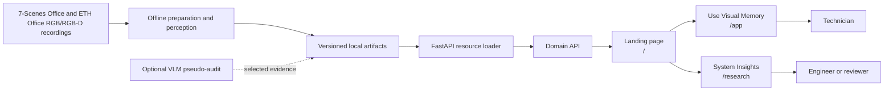
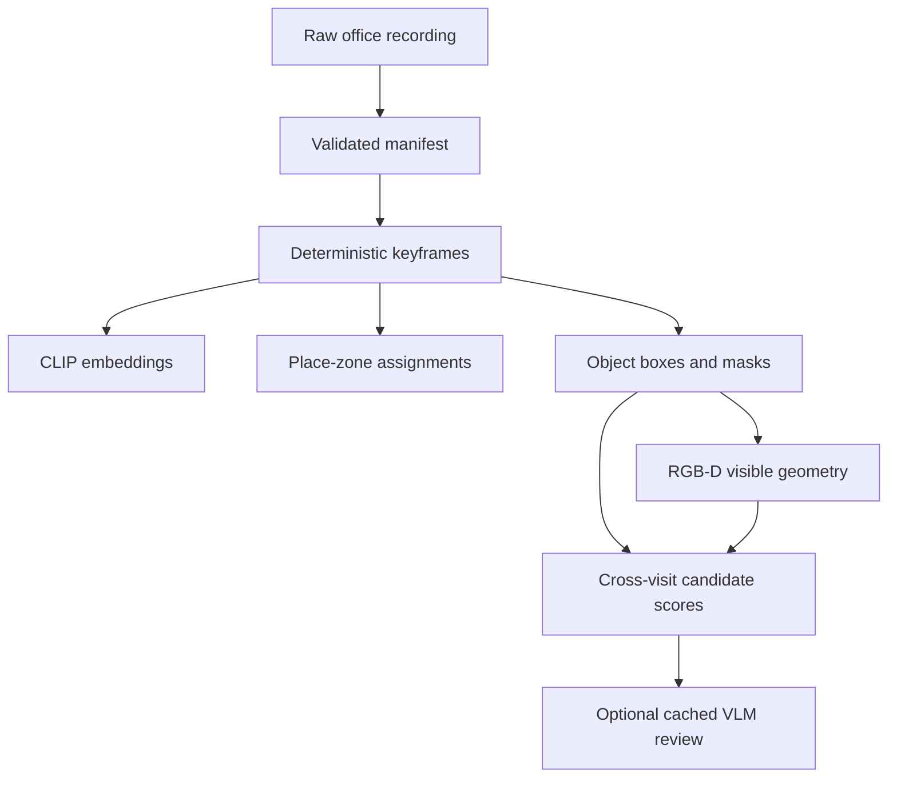

# Visual Memory Lab: Office System Design

## 1. Purpose

Visual Memory Lab is an evidence-first system for remembering real office spaces. It is aimed at a technician, inspector, or facilities worker who revisits an area and later asks:

> “Where was this object or workstation seen before, and what evidence supports the answer?”

The system separates four things that are often confused:

```text
retrieval → perception → association → interpretation
```

Retrieval finds candidate observations. Perception identifies visible image regions. Association ranks whether regions from different visits could correspond. Interpretation explains the evidence while stating what remains uncertain.

## 2. System at a glance



The browser does not run CLIP indexing, object detection, segmentation, RGB-D processing, or VLM analysis during ordinary page loads. Those jobs run offline and write inspectable artifacts.

The landing page (`/`) is a choice page with two workspace entry points:

- `/app` is the **Office assistant** workspace for technicians and users. Its
  primary actions are Ask memory, Inspect, and History. Object lookup,
  comparison, and evidence details appear inside those workflows when needed.
- `/research` is the **Research workspace** for reviewers and engineers.
  It is organized around questions
  such as retrieval quality, detector coverage, zone assignments, geometry,
  association candidates, and failure modes.

This is one office evidence system with two presentations, not two separate
pipelines or two copies of the data.

## 3. Data sources

### 7-Scenes Office

7-Scenes Office supplies RGB frames and recorded camera poses. It supports place-memory evaluation: whether a retrieved image comes from a sufficiently nearby physical viewpoint.

The repository uses an official 6,000-memory / 4,000-query split. Sequence IDs identify recordings, but they are not treated as calendar timestamps.

### ETH Office

The ETH Office recording supplies RGB images, coloured point clouds, and recorded transforms for four logical office visits. It supports object localization, visible 3D evidence, and cautious cross-visit comparison.

The data is referenced locally and is not redistributed.

## 4. Offline pipeline



Every run records its inputs, configuration, model identifiers, and output paths. Images, masks, embeddings, JSONL records, and summaries remain separate so that a reviewer can inspect the source evidence without loading the entire run into memory.

## 5. Retrieval layer

CLIP ViT-B/32 maps an image or text query to a normalized vector. The baseline uses exact search over the stored vectors.

```math
s(q,x_i) = \frac{q \cdot x_i}{\lVert q \rVert_2\lVert x_i \rVert_2}
```

The result includes the source observation ID, image path, score, sequence/visit metadata, camera pose where available, and evaluation context.

Retrieval is not the final answer. A visually similar workstation may be in the wrong area or from the wrong visit, so place and visit metadata remain part of the evidence.

## 6. Place and zone layer

The 7-Scenes pipeline evaluates retrieval against recorded camera poses. It reports coverage, hit@k, translation error, and rotation error.

The office zone vocabulary is a human-readable organization of recurring visual landmarks, such as:

- window-side dual-monitor workstation;
- bookshelf between workstations;
- central aisle by bookshelf;
- interior-window paired desks.

Zones improve browsing and query interpretation, but they are not precise room boundaries or geometric ground truth.

## 7. Object perception layer

The ETH object pipeline uses two frozen models:

```text
Grounding DINO → candidate box
SAM 2.1       → candidate pixel mask
```

Grounding DINO answers “where might an office chair, bin, or box be?” SAM 2.1 answers “which visible pixels belong to that candidate?”

The artifact stores:

- raw frame ID and visit;
- detector box and score;
- segmentation mask and score;
- overlay image;
- model names and configuration;
- optional cached audit status.

Neither model establishes persistent identity across visits. A prediction is evidence about one frame.

## 8. RGB-D evidence layer

The ETH data provides coloured point clouds and recorded transforms rather than a simple depth image plus intrinsics. The pipeline links visible mask pixels to compatible points and summarizes the visible subset in a shared room frame.

For visible points (P = \{p_i\}), the robust centroid is:

```math
\bar p = \mathrm{median}_{p_i \in P}(p_i)
```

The output also records point count and a robust spatial extent. This is partial visible geometry, not a complete object reconstruction. Different viewpoints can expose different surfaces even when the physical object has not changed.

## 9. Cross-visit association

Association ranks candidate detections from different logical visits. It combines appearance, shape, evidence quality, and approximate room-frame position:

```math
S(a,b) = w_a A(a,b) + w_s S_{shape}(a,b) + w_g G(a,b) + w_e E(a,b)
```

The current output is intentionally cautious:

- `likely_same`;
- `possible_match`;
- `uncertain`.

A large position difference can support a possible movement hypothesis, but it does not prove that the two detections are the same physical object or that a person moved it.

## 10. Artifact architecture

| Artifact | Contents | Consumer |
| --- | --- | --- |
| Office manifest | frame IDs, visits, poses, source paths | preparation and evaluation |
| Memory index | normalized embeddings and metadata | retrieval API |
| Zone artifact | zone definitions and frame assignments | zone pages and evaluation |
| Object localization | boxes, masks, overlays, scores | object page |
| RGB-D evidence | visible points, centroids, extents | evidence page and association |
| Association artifact | candidate pairs, scores, claim boundaries | compare-visits page |
| VLM audit | cached structured judgments and provenance | failure analysis |

JSONL records are streamable and inspectable. Large images, masks, and embeddings remain separate files. The API exposes only allow-listed artifact files.

## 11. Domain API

```text
GET  /api/health
GET  /api/capabilities
GET  /api/memory
GET  /api/memory/evaluation
POST /api/search/text
POST /api/search/image
GET  /api/images/{collection}/{observation_id}
GET  /api/zones
GET  /api/zones/{slug}
GET  /api/objects
GET  /api/objects/images/{image_id}
GET  /api/evidence
GET  /api/associations
GET  /api/queries
GET  /api/queries/{query_id}
POST /api/analyze/text
POST /api/analyze/image
```

The API is read-only for ordinary browsing. Optional cloud analysis is a separate, explicit action and is disabled without an API key.

## 12. UI structure

```text
Landing page (/) — choose a workspace
├── Use Visual Memory workspace (/app)
│   ├── Ask memory
│   ├── Find objects
│   ├── Compare visits
│   └── Evidence
└── System Insights workspace (/research)
    ├── Overview and evaluation
    ├── Failures
    ├── Zones
    ├── Objects
    ├── 3D evidence
    └── Associations
```

The primary technician navigation contains only Ask memory, Inspect, and
History. The technician pages keep the question and evidence together. The
research pages expose measurements and intermediate artifacts without making
the technician navigate through them. The detailed routes for objects, visit
comparison, evidence, and task checks remain available for focused review but
are not shown as primary technician tabs.

Each evidence-bearing page shows:

- source frame and visit;
- image, crop, box, or mask;
- score and provenance;
- pose or geometry summary;
- a plain-language claim boundary.

The UI should prefer “possible match” or “not enough evidence” over an unsupported definitive answer.

## 13. Evaluation and failure boundaries

The system measures:

- pose coverage and hit@1/5/10;
- translation and rotation error;
- zone agreement;
- cross-traversal retrieval quality;
- detector and mask evidence;
- RGB-D point coverage;
- association score and uncertainty.

The most important boundaries are:

```text
similarity ≠ physical identity
not detected ≠ absent
visible geometry ≠ complete object model
candidate match ≠ verified movement
sequence order ≠ calendar time
VLM review ≠ human ground truth
```

## 14. Scaling path

The current system is a local modular monolith suitable for research iteration. If a real deployment required larger scale, the same stages could become:

```text
ingestion service
→ asynchronous GPU jobs
→ object storage and metadata database
→ vector index with exact reranking
→ evidence API
→ authenticated technician UI
```

That expansion should follow measured workload and reliability needs. The current artifact boundary keeps the research system understandable.

## 15. Design principles

1. Retrieve evidence before generating prose.
2. Keep expensive perception offline and reproducible.
3. Preserve source IDs and model provenance.
4. Separate place, object, geometry, identity, and interpretation.
5. Measure coverage before blaming retrieval.
6. Make uncertainty visible to the user.
7. Do not claim more than the dataset can establish.
8. Add complexity only when a measured failure requires it.
