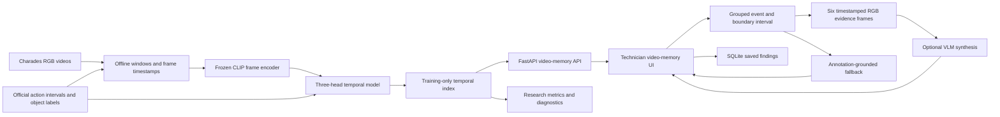
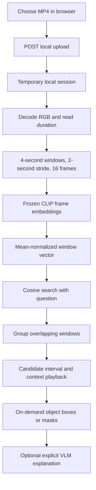
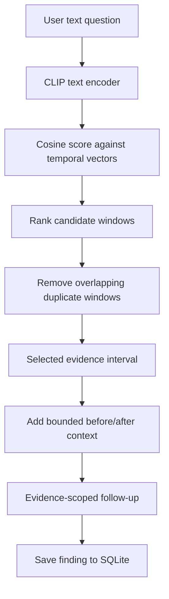
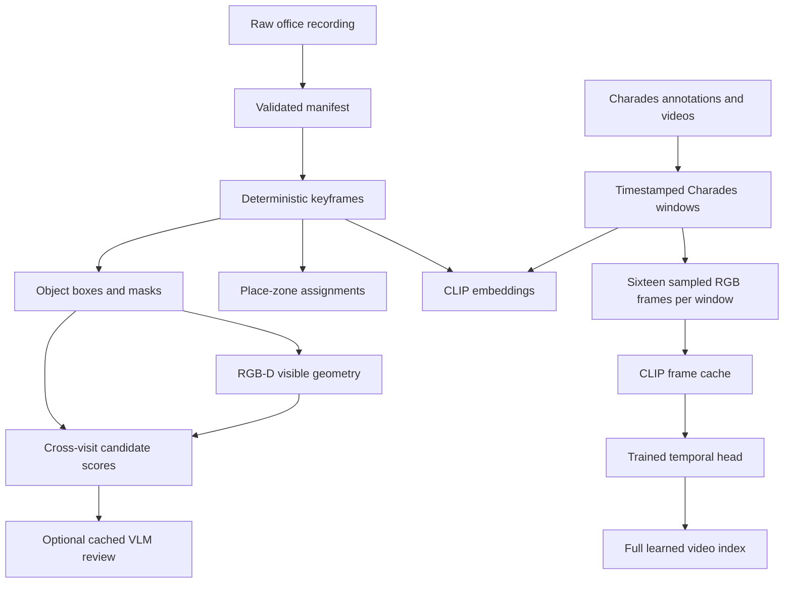
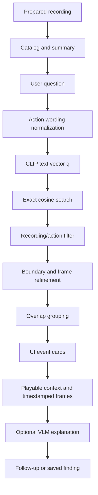
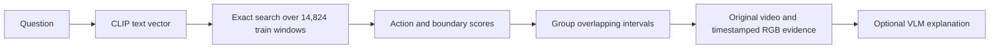
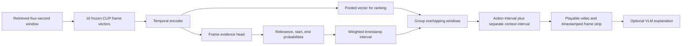
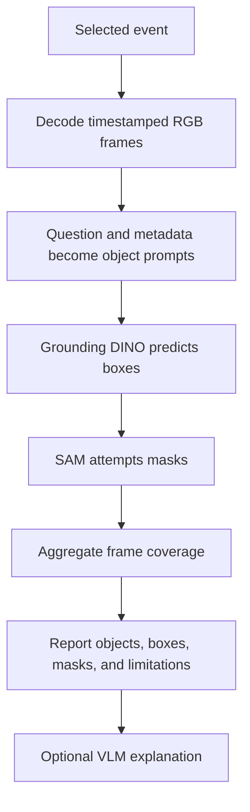

# Visual Memory Lab: Video Memory System Design and Architecture

## 1. Purpose

Visual Memory Lab is an evidence-first video memory assistant. A technician
chooses a recording, asks a plain-language question, reviews a timestamped event
with playable evidence, asks a follow-up, and saves a cautious finding. The main
product is the video-memory workflow; the earlier office/image work is an
archive and research surface rather than the primary user path.

The system keeps four ideas separate:

```text
retrieval → perception → association → interpretation
```

Retrieval finds candidate video windows. Temporal localization groups overlapping
windows and estimates the event interval. Evidence review shows playable RGB
frames. Interpretation produces a bounded explanation and states what remains
uncertain.

The implementation-level Charades contracts, tensor shapes, formulas, and
reference metrics are maintained in [Charades video memory](charades_video_memory.md).
This document stays at system-architecture level. Earlier experiments and
phase-by-phase rationale are preserved in the [documentation archive](archive/README.md).

## 2. System at a glance



There is one backend and one set of prepared artifacts. The landing page presents
the primary video application, while secondary routes expose research evidence:

- `/app` is the video memory application. It requires a recording before a time-based question can be asked.
- `/archive/office` keeps the earlier office/image workflows available without placing them in the main user path.
- `/research` is a secondary validation view. It exposes video retrieval evaluation plus the archived office/image diagnostics.

The browser does not run CLIP indexing, object detection, segmentation, or RGB-D processing during ordinary page loads. Those jobs run offline. The UI reads their outputs through the API.

For video, the browser also does not decode every recording into embeddings. The
prepared window manifest and learned temporal index are loaded once by the API.
The current full artifacts contain 18,994 four-second windows, with 14,824
training windows in the learned index. If that index is unavailable, the API
falls back to annotation-based lexical search and labels the result honestly.

The guided showcase at `/app/demo` is a presentation layer over the same API.
The earlier office-image showcase remains available only for historical comparison.

### Local private-video path

Prepared Charades recordings are the research path. A user-provided recording
uses the same downstream playback and object-evidence contracts but has no
official action labels:



For local video window $u$, the first implementation uses a transparent frozen
CLIP baseline:

$$
\mathbf{v}_u = \operatorname{Normalize}\left(\frac{1}{16}
\sum_{j=1}^{16} \mathbf{x}_{u,j}\right),
\qquad
s(u,q)=\mathbf{v}_u^\top\mathbf{q}.
$$

Here $\mathbf{x}_{u,j}$ is the normalized CLIP embedding for frame $j$ and
$\mathbf{q}$ is the normalized CLIP text embedding for the question. This
produces a visual candidate, not a verified action boundary, because a private
recording has no Charades-style ground truth. The trained temporal head remains
the research/evaluation path.

The local upload runs as a background job. The UI reports four friendly stages:

```text
upload file
    -> check duration and decodability
    -> build four-second RGB windows
    -> compute one CLIP vector per window
    -> finish the local session
    -> enable search
```

If raw windows at 0--4 s, 2--6 s, and 4--8 s are retrieved, the API groups
them into one 0--8 s candidate moment. The representative score is the best
score among the contributing windows, while their IDs remain attached as
evidence. This is temporal deduplication for presentation, not a learned event
detector. Object inspection samples at most 32 timestamps uniformly across a
grouped moment to keep the detector request bounded.

Uploaded media is stored below `outputs/local-video-sessions/`, ignored by Git,
and cleaned after its local retention period. The API does not send it to a
cloud provider automatically; VLM analysis is an explicit separate action.

## 3. Canonical video-memory flow

```text
technician selects a recording
          ↓
asks: “When did the person open the cabinet?”
          ↓
CLIP text embedding searches the learned temporal index
          ↓
action scores and boundary head refine the best windows
          ↓
overlapping windows are grouped into distinct events
          ↓
the UI shows the event time plus a wider playback context
          ↓
six RGB frames are sampled for optional VLM explanation
          ↓
answer cites evidence, confidence, and limitations
          ↓
technician confirms, rejects, or saves a finding
```

For a four-second window $[t_s,t_e]$, the boundary head predicts normalized
coordinates $(\hat{s},\hat{e})$. The event interval is:

$$
I_e=[t_s+(t_e-t_s)\hat{s},\ t_s+(t_e-t_s)\hat{e}].
$$

The player adds two seconds of context on either side:

$$
I_c=[\max(0,s-2),\ \min(T,e+2)].
$$

The VLM sees only the selected event's sampled frames and official metadata. It
does not search the archive and does not create the temporal ground truth.

## Archived office and research surfaces

```text
current question or uploaded photo
          ↓
local retrieval of earlier office evidence
          ↓
technician chooses an earlier view
          ↓
side-by-side comparison
          ↓
plain-language observations and limitations
          ↓
optional VLM-backed summary/report
          ↓
saved local inspection record
```

For an uploaded image, the current photo is stored locally, optionally summarized, and used as the query for retrieval. The user can choose an earlier result and compare it with the uploaded photo. A report can list visible objects, visible conditions, supporting evidence, differences that need checking, and a recommended manual check.

An uploaded photo is not automatically assigned a dataset sequence, visit, camera pose, or semantic zone. The report must therefore distinguish “uploaded current photo” from a recorded office memory.

### Video inspection flow

```text
question or selected recording
          ↓
learned CLIP + temporal retrieval, when the full index is available
          ↓
distinct playable candidate windows
          ↓
technician selects one moment
          ↓
before / during / after playback context
          ↓
evidence-scoped follow-up question
          ↓
status, note, and explicit saved video finding
```

The summary path is slightly different:

```text
choose recording
      ↓
recording-level description
      ↓
group timed Charades annotations into readable events
      ↓
show raw annotations on demand
      ↓
select an event and review its context
      ↓
ask, review, and save a finding
```

The recording-level description is broad context. The timed event list contains
only actions that Charades explicitly labelled with start and end times. It is
therefore possible for a video description to mention cleaning a sink while the
timed list contains only a shelf-tidying annotation. The UI distinguishes these
sources instead of presenting the timed list as a complete summary.

### Video request flow with the associated math

The following diagram shows what happens after a user submits a question. The
same flow is used for a technician question such as *“When did someone hold a
bag?”*.



#### 1. Convert the question into a vector

The text encoder maps the question to a normalized vector:

$$
\mathbf{q} = f_{\mathrm{text}}(\text{question}),
\qquad
\lVert\mathbf{q}\rVert_2 = 1.
$$

For example, the question *“When did someone hold a bag?”* becomes a point in
the same 512-dimensional CLIP space as the stored video-window vectors.

#### 2. Compare the question with each video window

Each four-second window has a learned temporal vector
$\mathbf{v}_i$. The temporal encoder combines the sixteen ordered frame
embeddings from that window in the current reference run:

$$
\mathbf{v}_i
= g\left(\mathbf{x}_{i,1},\mathbf{x}_{i,2},\ldots,\mathbf{x}_{i,16}\right).
$$

Here, $\mathbf{x}_{i,j}$ is the CLIP embedding of frame $j$ in window $i$,
and $g$ is the small trainable temporal head. It learns how to combine the
ordered observations into one 512-dimensional representation. The order matters:
the first frame is earlier in the window than the sixteenth frame.

The current retrieval score is cosine similarity:

$$
s_i
= \cos(\mathbf{q},\mathbf{v}_i)
= \frac{\mathbf{q}^{\mathsf T}\mathbf{v}_i}
        {\lVert\mathbf{q}\rVert_2\lVert\mathbf{v}_i\rVert_2}.
$$

The API ranks windows by decreasing $s_i$. A high score means that the
question and the window are close in the learned representation; it is not a
proof that the action occurred.

#### 3. Remove redundant windows

Because windows overlap by design, neighbouring results may describe the same
moment. For two intervals $I_i$ and $I_j$, their temporal overlap is:

$$
\mathrm{IoU}(I_i,I_j)
= \frac{|I_i\cap I_j|}{|I_i\cup I_j|}.
$$

If the overlap is above the presentation threshold and the windows come from
the same recording, the lower-ranked duplicate is suppressed. This changes the
displayed list, not the stored embeddings.

For example, the intervals $[0,4]$ and $[2,6]$ have IoU $1/3$, which is above
0.25. If they come from the same recording, only the higher-ranked one is kept
in the visible result list.

#### Current runtime values

These are the values used by the current application, not abstract tuning
parameters:

| Quantity | Current value | Meaning |
| --- | ---: | --- |
| Window length | 4 seconds | Each stored video memory covers four seconds. |
| Window stride | 2 seconds | A new window starts every two seconds, so neighbouring windows overlap. |
| Frames per window | 16 RGB frames | The temporal encoder receives sixteen ordered observations in the current reference run. |
| Default result count, $k$ | 8 | The UI displays up to eight candidate moments. |
| Internal candidate count | $4k$ | The learned search temporarily retrieves more candidates before cleanup. |
| Maximum results per video | 2 | Prevents one recording from filling the whole result list. |
| Video duplicate IoU threshold | 0.25 | Same-video windows with IoU at least 0.25 are treated as overlapping display duplicates. |
| Context padding, $\delta$ | 2 seconds | The player adds up to two seconds before and after the selected interval. |
| Follow-up overlap threshold | 0 seconds | Any non-empty intersection with the selected evidence interval is included. |

There is no cosine-similarity cutoff in the current learned search. Results are
ranked even when every candidate is a weak match, so the UI must be read as
“best available evidence,” not “the system proved this happened.”

The video IoU threshold is different from the object-detection NMS IoU
threshold. Video IoU removes redundant time windows for presentation; object
NMS removes duplicate detector boxes in one image. The current object NMS value
is 0.50 and does not affect video retrieval.

#### 4. Add context around the selected moment

If the selected event is $[t_s,t_e]$, the player shows a small context
interval:

$$
t_{\mathrm{context}}
= \left[
\max(0,t_s-\delta),
\min(T,t_e+\delta)
\right],
$$

where $T$ is the recording duration and $\delta=2$ seconds in the current
UI. This helps the reviewer see what happened immediately before and after the
retrieved window.

For example, if the selected result is $[10,14]$ seconds, the player requests
$[8,16]$ seconds. If the event starts at 0 seconds, the lower bound remains 0;
the context cannot become negative. If the recording ends at 15 seconds, the
upper bound becomes 15 rather than 16.

#### 5. Restrict follow-up answers to the selected evidence

For a follow-up interval $J$, an official action interval $A_k$ is included
only when:

$$
A_k \cap J \neq \varnothing.
$$

The answer is generated from the intersecting annotations and their evidence
window IDs. It does not silently search the whole recording or archive.

For example, if the selected evidence is $J=[10,14]$ and an annotation covers
$[12,16]$, it is included because the intervals overlap. An annotation covering
$[16,18]$ is not included because it has no intersection with the selected
evidence.

#### 6. Save the reviewed finding

The saved finding is a traceable record:

$$
\mathcal{F}
= (\text{video id},\text{question},J,\text{answer},
   \text{evidence ids},\text{status},\text{note}).
$$

SQLite stores $\mathcal{F}$ locally so the user can reopen the recording,
timestamp, answer, and review status later.

## 4. Data sources and preparation

### 7-Scenes Office

7-Scenes Office supplies RGB frames and recorded camera poses. It supports place-memory evaluation: whether a retrieved image comes from a sufficiently nearby physical viewpoint. The project uses the official 6,000-memory / 4,000-query split. Sequence order is not calendar time.

### ETH Office

The ETH Office recording supplies RGB images, coloured point clouds, and recorded transforms for four logical office visits. It supports object localization, visible 3D evidence, and cautious cross-visit comparison. The data is referenced locally and is not redistributed.

### Charades

Charades supplies RGB videos with action intervals, object labels, and natural-
language descriptions. It supports temporal memory questions such as “when
did the person open the door?” It does not supply metric depth or camera poses,
so it is not used for 3D measurement.

### Offline pipeline



Each run records its input, configuration, model identifiers, and output paths. Images, masks, embeddings, JSONL records, and summaries remain separate so a reviewer can inspect source evidence without loading every artifact into memory.

## 5. Retrieval and place memory

CLIP ViT-B/32 maps an image or text query to a normalized vector. The baseline searches every stored vector exactly:

```math
s(q,x_i) = \frac{q \cdot x_i}{\lVert q \rVert_2\lVert x_i \rVert_2}
```

In plain English, the score measures how closely the query and a stored image point in the same embedding direction. The result includes the source observation, image path, score, sequence/visit metadata, and camera pose where available.

Retrieval is evidence selection, not the final answer. A visually similar workstation may be in the wrong area or from the wrong visit, so the UI shows source metadata and claim boundaries.

The 7-Scenes evaluation reports pose coverage, hit@k, translation error, and rotation error. Recurring visual landmarks are grouped into human-readable office zones such as a window-side dual-monitor workstation or a bookshelf between workstations. Zones help browsing and interpretation; they are not exact room boundaries.

## 6. Object perception

The ETH object pipeline uses two frozen models:

```text
Grounding DINO → candidate box
SAM 2.1       → candidate pixel mask
```

Grounding DINO proposes where an office chair, bin, or box might be. SAM 2.1 selects the visible pixels belonging to that proposal. Artifacts store the frame and visit, detector box and score, mask and score, overlay, model configuration, and optional audit status.

These outputs describe one frame. They do not establish a persistent object ID across visits. A missed detection is not evidence that the object is absent.

## 7. RGB-D evidence

ETH provides coloured point clouds and recorded transforms rather than a simple depth image plus camera intrinsics. The pipeline links visible mask pixels to compatible points and summarizes those points in a shared room frame.

For visible points `P = {p_i}`, the robust centroid is:

```math
\bar p = \mathrm{median}_{p_i \in P}(p_i)
```

In plain English, this is the middle 3D location of the visible points. A median is less sensitive than a mean to a few noisy points. The artifact also records point count and a robust spatial extent. This is partial visible geometry, not a complete object model; different viewpoints can expose different surfaces without any physical change.

## 8. Cross-visit association

Association ranks detections from different logical visits. It combines appearance, shape, evidence quality, and approximate room-frame position:

```math
S(a,b) = w_a A(a,b) + w_s S_{shape}(a,b) + w_g G(a,b) + w_e E(a,b)
```

The score is a ranking aid. Current labels are `likely_same`, `possible_match`, and `uncertain`. A position difference may support a possible movement hypothesis, but it does not prove persistent identity or movement.

## 9. Artifact and storage architecture

| Artifact | Contents | Main consumer |
| --- | --- | --- |
| Office manifest | frame IDs, visits, poses, source paths | preparation and evaluation |
| Memory index | normalized embeddings and metadata | retrieval API |
| Zone artifact | zone definitions and frame assignments | application and research zone views |
| Object localization | boxes, masks, overlays, scores | research object view |
| RGB-D evidence | visible points, centroids, extents | research evidence and association views |
| Association artifact | candidate pairs, scores, claim boundaries | research association view |
| Charades window manifest | recording IDs, time windows, actions, objects, descriptions | video API and timeline UI |
| Learned video index | temporal vectors for 14,824 training windows | text-to-moment retrieval |
| Video finding records | question, interval, answer, status, note, evidence IDs | video history |
| Inspection database | uploaded image path, question, selected evidence, comparison, summary, report | application history |
| VLM analysis | cached structured summaries and provenance | inspection report and research review |

Large images, masks, and embeddings remain separate files. SQLite stores inspection metadata and structured report JSON; it is not the vector database and does not replace the offline image index.

## 10. Domain API

```text
GET  /api/health
GET  /api/capabilities
GET  /api/memory
GET  /api/memory/evaluation
POST /api/search/text
POST /api/search/image
GET  /api/images/{collection}/{observation_id}
GET  /api/zones
GET  /api/zones/{slug}
GET  /api/objects
GET  /api/objects/images/{image_id}
GET  /api/evidence
GET  /api/associations
GET  /api/video-memory
GET  /api/video-memory/catalog
POST /api/video-memory/summarize
POST /api/video-memory/follow-up
POST /api/video-memory/synthesize
POST /api/video-memory/findings
GET  /api/video-memory/findings
GET  /api/video-memory/findings/{finding_id}
GET  /api/video-memory/videos/{video_id}
GET  /api/queries
GET  /api/queries/{query_id}
GET  /api/inspections
GET  /api/inspections/{inspection_id}
POST /api/inspections
POST /api/inspections/with-image
GET  /api/inspections/{inspection_id}/current-image
POST /api/inspections/{inspection_id}/compare
POST /api/inspection-summary/image
POST /api/inspections/{inspection_id}/summary
POST /api/inspections/{inspection_id}/report
POST /api/analyze/text
POST /api/analyze/image
```

Ordinary retrieval and artifact browsing are local. Cloud/VLM analysis is an explicit action and is unavailable without `OPENAI_API_KEY`. The API allow-lists artifact paths rather than exposing the filesystem.

## 11. UI structure

```text
Landing page (/)
├── Office assistant (/app)
│   ├── Ask memory
│   ├── Inspect current photo (/app/inspect)
│   ├── Video memory (/app/video)
│   ├── Saved office inspection history (/app/inspections)
│   └── Saved video findings (/app/video-history)
└── Research workspace (/research)
    ├── Overview and evaluation
    ├── Failure browser
    ├── Office zones
    ├── Object boxes and masks
    ├── RGB-D evidence
    └── Cross-visit associations
```

Detailed routes for focused object, comparison, evidence, and task review remain available where implemented, but they are not primary technician navigation. Evidence-bearing pages should show source frame/visit, image or crop, score/provenance, relevant pose or geometry, and a plain-language claim boundary.

## 12. Evaluation and failure boundaries

The research view measures pose coverage and hit@k, translation and rotation error, zone agreement, cross-traversal retrieval quality, detector and mask evidence, RGB-D point coverage, association uncertainty, and technician-question evidence recall.

The central safety boundaries are:

```text
similarity ≠ physical identity
not detected ≠ absent
visible geometry ≠ complete object model
candidate match ≠ verified movement
sequence order ≠ calendar time
uploaded photo ≠ dataset-labeled visit
VLM review ≠ human ground truth
```

## 13. Current limits and future work

The current system is an offline local prototype. Office image uploads and
prepared Charades recordings are supported; arbitrary live video ingestion is
not yet supported. Video answers are grounded in learned retrieval and/or
official annotations, not persistent object identity or a complete VLM scene
understanding. The system does not yet provide reliable true change detection
under viewpoint and lighting changes or authenticated multi-user deployment.
Future work should be driven by measured failures and controlled repeated-visit
data.

## 14. Design principles

1. Retrieve evidence before generating prose.
2. Keep expensive perception offline and reproducible.
3. Preserve source IDs and model provenance.
4. Separate place, object, geometry, identity, and interpretation.
5. Measure coverage before blaming retrieval.
6. Make uncertainty visible to the user.
7. Do not claim more than the dataset can establish.
8. Add complexity only when a measured failure requires it.

## 15. Learned video retrieval and answer synthesis

### 15A. Full inference pipeline and UI contract

The primary product path starts with a prepared Charades recording. The
browser does not train a model or rebuild the index when a user asks a
question. At startup, the API loads the prepared manifest, the frozen-CLIP
compatible temporal index, and the optional language/VLM services. The user
then selects a recording and asks a question against that recording.

```text
prepared Charades MP4 + manifest
    -> catalog loaded by the API
    -> user selects one recording
    -> user enters a question
    -> wording is mapped to compatible recording actions
    -> CLIP text embedding
    -> exact search over learned temporal vectors
    -> action filtering and temporal refinement
    -> overlapping windows grouped into events
    -> playable MP4 interval + timestamped RGB frames
    -> optional VLM explanation
    -> follow-up question and SQLite finding
```

For the question “When did the person hold some medicine?”, the action shown
after retrieval is normally the official Charades label `Holding some medicine`.
The label is available because the prepared manifest contains the annotation;
the VLM is not inventing that label. The learned model ranks and refines the
evidence window, while the UI keeps the annotation and model estimate visibly
separate.

The browser’s actions come from three places:

| UI field | Source | Meaning |
| --- | --- | --- |
| Recording summary | Charades description | High-level context shown before search. |
| Timeline actions | Official action intervals | Direct annotation audit view. |
| Result primary/context actions | Action records attached to retrieved windows | The selected action and overlapping labels. |
| Refined timestamp | Phase 12 temporal head | Model estimate inside the retrieved window. |
| VLM explanation | Selected RGB frames only | A bounded visual interpretation, not ground truth. |

The current application therefore answers “where is the evidence for this
recorded action?” It does not yet answer “what entirely new action occurred in
an arbitrary uploaded video?” without an additional proposal model.



The future arbitrary-upload extension would add a preparation stage before
the current search path:

```text
uploaded video
    -> validation and temporary storage
    -> frame decoding with timestamps
    -> ordered windows
    -> CLIP frame embeddings
    -> temporal representation
    -> action proposal vocabulary/model
    -> timestamped event records
    -> current evidence-review UI
```

That future stage must define how labels are produced. It cannot silently use
Charades labels as if they were ground truth for a new video.

The current video path is deliberately two-stage. First, the learned temporal
index finds and refines evidence. Second, an optional VLM explains only that
selected evidence.

The current temporal reference consumes 16 RGB samples per four-second window.
The VLM review step may sample a smaller set of timestamped frames from the
selected event; those review frames are evidence for explanation, not additional
training input. The detailed tensor contract and current metrics are in
[Charades video memory](charades_video_memory.md).



```text
question
  → CLIP text embedding
  → learned temporal index
  → action scores + boundary estimate
  → group overlapping windows into one event
  → sample six RGB frames from the event
  → VLM answer with citations and limitations
  → annotation fallback when cloud analysis is unavailable
```

For a four-second window $[t_s,t_e]$, the temporal model produces a normalized
boundary $(\hat{s},\hat{e})$. The event interval is:

$$
I_e=[t_s+(t_e-t_s)\hat{s},\ t_s+(t_e-t_s)\hat{e}].
$$

The browser plays a little context around it:

$$
I_c=[\max(0,s-\delta),\ \min(T,e+\delta)],\qquad \delta=2\text{ s}.
$$

The three-head model is trained with:

$$
\mathcal{L}=\mathcal{L}_{\mathrm{retrieval}}
 +\lambda_a\mathcal{L}_{\mathrm{action}}
 +\lambda_b\mathcal{L}_{\mathrm{boundary}}.
$$

Official Charades action intervals supervise these targets; they are not
generated by the VLM. The VLM is a bounded language layer: it may describe what
is visible in the six supplied frames, cite their evidence IDs, and acknowledge
uncertainty. It may not search the full archive, invent a timestamp, or turn a
similar-looking clip into proof of an event.

### Phase 12 refinement stage



The pooled vector answers “which window is relevant?” The frame head answers
“where inside that window should the reviewer look?” For frame timestamps
$t_1,\ldots,t_m$, the start and end estimates are:

$$
\hat{s}=\frac{\sum_jt_jp^s_j}{\sum_jp^s_j},\qquad
\hat{e}=\frac{\sum_jt_jp^e_j}{\sum_jp^e_j}.
$$

The API returns both the refined interval and the official annotation interval.
The browser uses a padded context interval only for playback. A ten-second
player therefore does not imply that the action lasted ten seconds: the
evidence record states the localized interval and its source separately.

### Phase 13 object-aware inspection card

After a reviewer selects an event, the API can inspect only that event's RGB
frames. This keeps expensive perception work out of ordinary catalog browsing.



For a question such as “Did someone take medicine from the cabinet?”, the
prompt set may contain `medicine`, `cabinet`, and `shelf`. Each result keeps the
frame timestamp, phrase, confidence, normalized box, and whether a mask was
available. If an object appears in 4 of 6 frames, the UI reports **Partially
visible**; it does not claim that the object was absent from the other frames.

For an image of width \(W\) and height \(H\), a detector box in pixels is
converted to the browser coordinate system by

$$
\mathbf{b}_{norm}=\left[
\frac{x_1}{W},\frac{y_1}{H},\frac{x_2}{W},\frac{y_2}{H}
\right].
$$

The application report keeps four sources separate: the recorded annotation,
the learned temporal retrieval, the frozen object detector/segmenter, and the
optional VLM explanation. This makes the result useful for a technician while
preserving a clear research boundary: a predicted box or mask is visible
evidence, not a persistent object identity or ground truth.

### Event-synchronized object overlays

The application presents object evidence inside the selected event player. A
retrieved interval such as (4.0\text{--}8.0\,s) is rendered over a wider
context clip, while detections are drawn only during the event interval. RGB
frames are sampled across the interval, and nearby same-label boxes are joined
with a lightweight IoU association. This gives the user a readable visual
track without claiming persistent identity. Segmentation masks are optional;
the interface falls back to detector boxes when masks are unavailable.
