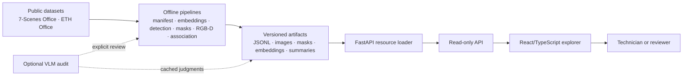
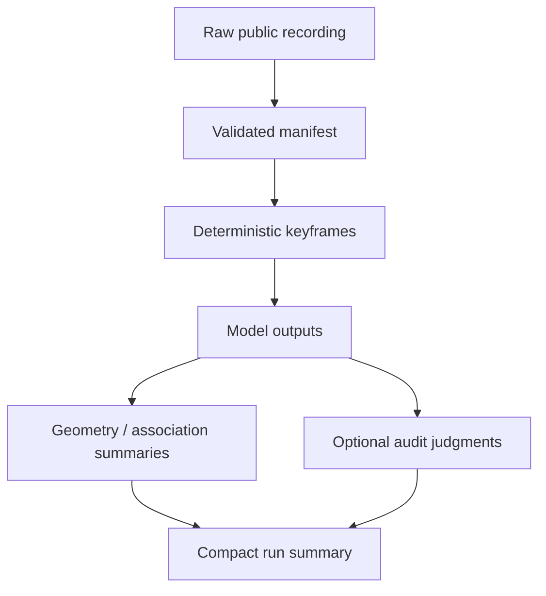
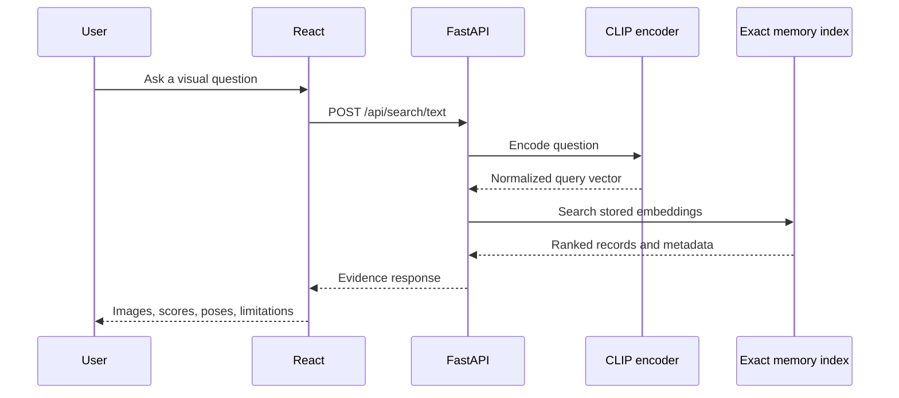
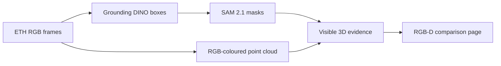
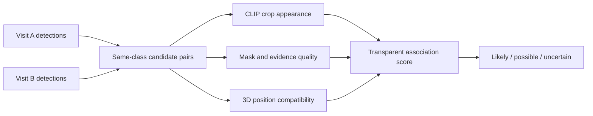

# Visual Memory Lab: System Design and Architecture

## 1. What this system is

Visual Memory Lab is a research system for answering questions about earlier
visual observations. It is aimed at a technician, inspector, or facilities
worker who revisits the same office or work area and later needs evidence:

> “Where was the chair last seen, and what evidence supports that answer?”

The system is not a general office chatbot. Its central rule is:

```text
retrieve evidence first → interpret it second → state the limits clearly
```

The current implementation is a local modular monolith. Expensive perception
and indexing jobs run offline and write versioned artifacts. A FastAPI service
loads those artifacts, and a React/TypeScript application lets a person inspect
the evidence.

## 2. Current architecture at a glance



The arrows are intentionally asymmetric. The browser does not rerun Grounding
DINO, SAM, CLIP indexing, or the VLM for every page load. It reads an artifact
that has already been produced, checked, and given a claim boundary.

## 3. Main subsystems

### Dataset and manifest layer

The project uses three kinds of data:

- 7-Scenes Office RGB frames and camera poses for place memory;
- ETH ASL Change Detection Office recordings with RGB images, coloured point
  clouds, and recorded transforms.

Preparation code validates the expected files, chooses deterministic keyframes,
and writes manifests. A manifest is the stable link between a source frame and
its metadata: observation, frame index, logical visit, pose, and image path.

### Representation and retrieval layer

The visual-memory path uses frozen CLIP ViT-B/32 embeddings. Text questions and
images are mapped into the same normalized vector space, then searched with an
exact in-memory index. The retrieval result carries evidence metadata rather
than only a similarity score:

- image and observation identifier;
- episode or logical visit;
- camera pose;
- place-zone label when available;
- temporal and spatial evaluation metadata.

### Object perception layer

The ETH object baseline uses frozen models:

1. Grounding DINO predicts candidate boxes for chairs, bins, and boxes.
2. SAM 2.1 predicts a mask for each candidate box.
3. The artifact stores the raw frame, overlay, mask, scores, and model
   provenance.

The detector identifies a category. The segmenter estimates pixels. Neither
operation proves that two detections are the same physical object.

### RGB-D evidence layer

The ETH bags do not provide a simple depth image plus intrinsics. They provide
registered RGB-coloured point clouds and camera/world transforms. The pipeline
links a mask to compatible coloured points and summarizes the visible subset in
the shared world frame:

- valid point count;
- robust centroid;
- 5th–95th percentile spatial extent;
- source frame and detection identifiers.

This is approximate visible geometry, not a complete object reconstruction.

### Cross-visit association layer

The association baseline compares same-class detections from different logical
visits. It combines:

- frozen CLIP crop appearance similarity;
- mask area and shape compatibility;
- detector/mask/point-cloud evidence quality;
- approximate 3D position compatibility.

It returns `likely_same`, `possible_match`, or `uncertain`. A large spatial
distance can support a **possible movement** hypothesis, but does not establish
identity or prove that a person moved the object.

### Optional VLM audit layer

The VLM is a separate, explicit action. It reviews selected RGB evidence or
candidate pairs and returns a structured pseudo-judgment. It is cached with the
prompt version, model, image hashes, and parsed response. VLM judgments are
useful for failure analysis but are not human ground truth.

### Serving layer

`AppConfig` contains paths to the memory indexes, zones, evaluation artifacts,
object artifacts, RGB-D artifacts, and association artifacts. At startup,
FastAPI loads available resources into `AppResources`. Missing optional
artifacts do not prevent the rest of the application from serving.

The API is read-only for ordinary browsing. It exposes search, evaluation,
place-zone, object, RGB-D, and association payloads plus allowlisted image
files.

### UI layer

The React application is organized around evidence views:

```text
App / Layout
├── Ask memory
├── Evidence Lab
├── Failures
├── Zones
├── Objects
├── 3D evidence
└── Object identity
```

The UI keeps local retrieval separate from optional cloud analysis. It shows
the image, mask, scores, pose or 3D summary, and limitations next to any
interpretation.

## 4. Artifact architecture



The main artifact families are:

| Artifact | Contents | Why it exists |
| --- | --- | --- |
| Memory index | embeddings, records, source metadata | exact visual retrieval |
| Object localization | `frames.jsonl`, `detections.jsonl`, masks, overlays, `run.json` | inspectable detector output |
| RGB-D evidence | `evidence.jsonl`, centroids, extents, `run.json` | visible room-frame geometry |
| Association | crop embeddings, `associations.jsonl`, `run.json` | ranked cross-visit candidates |
| VLM audit | cached structured judgments and summaries | failure review without repeat calls |

JSONL keeps records streamable and inspectable. Images and masks remain files
so a reviewer can open them directly. Compact summaries make acceptance runs
easy to compare without loading every image or embedding.

## 5. End-to-end flows

### Text-to-memory retrieval



### Object and RGB-D evidence



### Cross-visit association



## 6. Important interfaces

The primary Python boundaries are:

- `ClipEncoder`: frozen image/text representation;
- `MemoryIndex` and `MemoryStore`: persisted retrieval data;
- object localization: detector and segmenter orchestration;
- RGB-D evidence builder: point-cloud linkage and geometric summaries;
- object association: candidate scoring and movement boundary;
- showcase loaders: artifact-to-public-payload conversion;
- `AppConfig` and `AppResources`: service configuration and startup resources.

Representative API families are:

| Route | Reads | Purpose |
| --- | --- | --- |
| `/api/search/text` | memory index | text-to-image retrieval |
| `/api/search/image` | memory index | image-to-image retrieval |
| `/api/objects` | localization artifact | object predictions |
| `/api/evidence` | RGB-D artifact | visible 3D evidence |
| `/api/associations` | association artifact | candidate pairs and scores |
| `/api/zones` | zone artifact | semantic place vocabulary |
| `/api/memory/evaluation` | evaluation artifact | retrieval metrics |

The response contract is evidence-first. A route can say that a model produced
a box or that two detections are a candidate pair. It must not silently turn
that into object absence, persistent identity, or definite movement.

## 7. Current capability boundaries

| Capability | Status | Evidence | Allowed claim |
| --- | --- | --- | --- |
| Place retrieval | Implemented | CLIP embeddings, pose, zones | “This memory is relevant to the place/query.” |
| Object localization | Implemented | detector boxes and masks | “The model predicts a chair here.” |
| RGB-D evidence | Implemented | coloured point clouds and transforms | “Visible geometry appears here.” |
| Cross-visit association | Baseline | score components and candidates | “These may be the same object.” |
| Movement | Tentative | candidate identity plus displacement | “Possible movement.” |
| Persistent identity | Not established | requires validated labels | no definitive identity claim |
| Added/removed reasoning | Future | requires visibility and temporal logic | not currently supported |

Missing coverage, occlusion, detector failure, and reconstruction ambiguity are
first-class failure modes. A missing detection is not proof that an object was
absent.

## 8. Target architecture and staged evolution

The long-term application can evolve toward this shape:


The stages are deliberately incremental:

1. **Current research system:** offline manifests and artifacts, local FastAPI,
   React evidence views.
2. **Object-memory evaluation:** reviewed pair labels, visibility checks, and
   stronger association metrics.
3. **State-change reasoning:** added, removed, moved, unchanged, and unknown
   outcomes grounded in comparable visits.
4. **Online ingestion:** synchronize a live camera stream, pose, RGB, and depth
   into visit records.
5. **Operational deployment:** replace local files selectively with durable
   object storage, metadata storage, job queues, model services, authentication,
   monitoring, and retention policies.

Queues, databases, distributed inference, and edge deployment are target
architecture only. They are not claims about the current repository.

## 9. Reliability, privacy, and operations

- Public datasets are cited and not redistributed through generated artifacts.
- Private household imagery is not required for the public project.
- VLM calls are explicit, optional, cached, and separated from ordinary local
  retrieval.
- Model revisions, prompts, thresholds, device, and source paths are recorded
  in run metadata where practical.
- Deterministic sampling and seeded simulator trajectories make experiments
  reproducible.
- CUDA is preferred when available; CPU remains a supported fallback.
- Logical visit order is not a calendar timestamp.
- The system must preserve uncertainty instead of converting weak evidence into
  a confident technician instruction.

## 10. Testing and observability

| Layer | Verification |
| --- | --- |
| Data preparation | expected files, dimensions, poses, and deterministic sampling |
| Representation | normalized embeddings and encoder compatibility |
| Perception | artifact schema, masks, boxes, model provenance |
| RGB-D | valid point handling, centroid/extent calculations, missing evidence |
| Association | same-class filtering, score thresholds, displacement boundaries |
| API | temporary-artifact loading, allowlisted images, missing-resource errors |
| UI | TypeScript build, route rendering, visible limitations and score breakdown |
| Research acceptance | run summaries, audited examples, failure categories, manual review |

The most important observable counts are not only successes. Empty frames,
unsupported detections, uncertain pairs, missing point-cloud evidence, and
coverage failures are retained because they explain when the system should not
answer confidently.

## 11. Design principles

1. **Evidence before answers.** Every interpretation should point back to
   inspectable images, masks, geometry, or metadata.
2. **Offline first for research.** Expensive processing is reproducible and
   reviewable before it becomes a service dependency.
3. **Separate category from identity.** “This looks like a chair” is not “this
   is the same chair.”
4. **Separate observation change from world change.** Camera viewpoint,
   occlusion, lighting, and reconstruction quality can change the evidence.
5. **Measure before training.** A learned component should target a measured
   failure, not be added simply because the system is incomplete.
6. **Keep the prototype honest.** The current modular monolith is useful for
   research and portfolio demonstration; production architecture is a later
   evolution, not an implied property of the local app.
