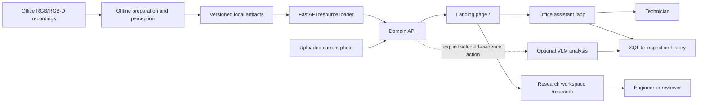
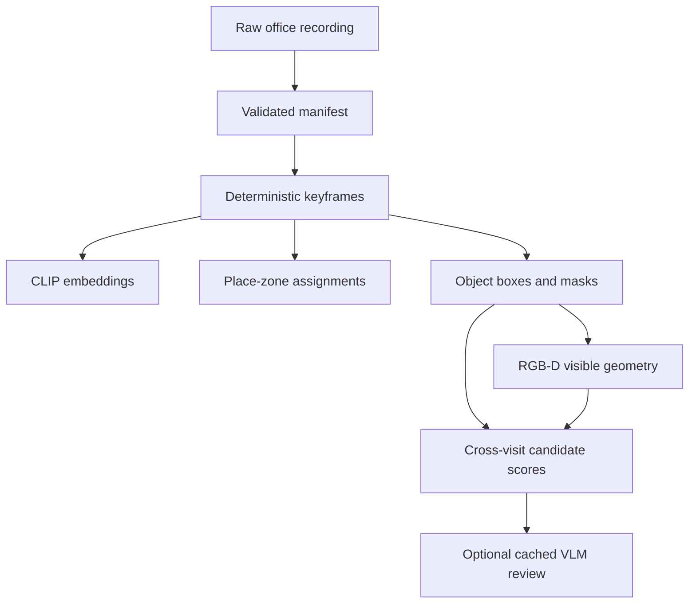

# Visual Memory Lab: Office System Design and Architecture

## 1. Purpose

Visual Memory Lab is an evidence-first office inspection assistant. A technician can upload a current office photo or ask about a known office view, retrieve relevant earlier evidence, compare views, and save a cautious inspection report.

The system keeps four ideas separate:

```text
retrieval → perception → association → interpretation
```

Retrieval finds candidate images. Perception identifies visible regions. Association ranks whether regions from different visits could correspond. Interpretation explains the evidence and states what remains uncertain.

## 2. System at a glance



There is one backend and one set of prepared artifacts. The landing page presents two views of that system:

- `/app` is the Office assistant. Its primary pages are Ask memory, Inspect, and History.
- `/research` is a secondary validation view. It exposes retrieval evaluation, failure cases, zones, object masks, RGB-D evidence, and associations.

The browser does not run CLIP indexing, object detection, segmentation, or RGB-D processing during ordinary page loads. Those jobs run offline. The UI reads their outputs through the API.

The guided showcase at `/app/demo` is a presentation layer over the same API. It selects a deterministic office question and two real retrieved views so a reviewer can understand the system in roughly 90 seconds without configuring a query first.

## 3. End-to-end technician flow

```text
current question or uploaded photo
          ↓
local retrieval of earlier office evidence
          ↓
technician chooses an earlier view
          ↓
side-by-side comparison
          ↓
plain-language observations and limitations
          ↓
optional VLM-backed summary/report
          ↓
saved local inspection record
```

For an uploaded image, the current photo is stored locally, optionally summarized, and used as the query for retrieval. The user can choose an earlier result and compare it with the uploaded photo. A report can list visible objects, visible conditions, supporting evidence, differences that need checking, and a recommended manual check.

An uploaded photo is not automatically assigned a dataset sequence, visit, camera pose, or semantic zone. The report must therefore distinguish “uploaded current photo” from a recorded office memory.

## 4. Data sources and preparation

### 7-Scenes Office

7-Scenes Office supplies RGB frames and recorded camera poses. It supports place-memory evaluation: whether a retrieved image comes from a sufficiently nearby physical viewpoint. The project uses the official 6,000-memory / 4,000-query split. Sequence order is not calendar time.

### ETH Office

The ETH Office recording supplies RGB images, coloured point clouds, and recorded transforms for four logical office visits. It supports object localization, visible 3D evidence, and cautious cross-visit comparison. The data is referenced locally and is not redistributed.

### Offline pipeline



Each run records its input, configuration, model identifiers, and output paths. Images, masks, embeddings, JSONL records, and summaries remain separate so a reviewer can inspect source evidence without loading every artifact into memory.

## 5. Retrieval and place memory

CLIP ViT-B/32 maps an image or text query to a normalized vector. The baseline searches every stored vector exactly:

```math
s(q,x_i) = \frac{q \cdot x_i}{\lVert q \rVert_2\lVert x_i \rVert_2}
```

In plain English, the score measures how closely the query and a stored image point in the same embedding direction. The result includes the source observation, image path, score, sequence/visit metadata, and camera pose where available.

Retrieval is evidence selection, not the final answer. A visually similar workstation may be in the wrong area or from the wrong visit, so the UI shows source metadata and claim boundaries.

The 7-Scenes evaluation reports pose coverage, hit@k, translation error, and rotation error. Recurring visual landmarks are grouped into human-readable office zones such as a window-side dual-monitor workstation or a bookshelf between workstations. Zones help browsing and interpretation; they are not exact room boundaries.

## 6. Object perception

The ETH object pipeline uses two frozen models:

```text
Grounding DINO → candidate box
SAM 2.1       → candidate pixel mask
```

Grounding DINO proposes where an office chair, bin, or box might be. SAM 2.1 selects the visible pixels belonging to that proposal. Artifacts store the frame and visit, detector box and score, mask and score, overlay, model configuration, and optional audit status.

These outputs describe one frame. They do not establish a persistent object ID across visits. A missed detection is not evidence that the object is absent.

## 7. RGB-D evidence

ETH provides coloured point clouds and recorded transforms rather than a simple depth image plus camera intrinsics. The pipeline links visible mask pixels to compatible points and summarizes those points in a shared room frame.

For visible points `P = {p_i}`, the robust centroid is:

```math
\bar p = \mathrm{median}_{p_i \in P}(p_i)
```

In plain English, this is the middle 3D location of the visible points. A median is less sensitive than a mean to a few noisy points. The artifact also records point count and a robust spatial extent. This is partial visible geometry, not a complete object model; different viewpoints can expose different surfaces without any physical change.

## 8. Cross-visit association

Association ranks detections from different logical visits. It combines appearance, shape, evidence quality, and approximate room-frame position:

```math
S(a,b) = w_a A(a,b) + w_s S_{shape}(a,b) + w_g G(a,b) + w_e E(a,b)
```

The score is a ranking aid. Current labels are `likely_same`, `possible_match`, and `uncertain`. A position difference may support a possible movement hypothesis, but it does not prove persistent identity or movement.

## 9. Artifact and storage architecture

| Artifact | Contents | Main consumer |
| --- | --- | --- |
| Office manifest | frame IDs, visits, poses, source paths | preparation and evaluation |
| Memory index | normalized embeddings and metadata | retrieval API |
| Zone artifact | zone definitions and frame assignments | application and research zone views |
| Object localization | boxes, masks, overlays, scores | research object view |
| RGB-D evidence | visible points, centroids, extents | research evidence and association views |
| Association artifact | candidate pairs, scores, claim boundaries | research association view |
| Inspection database | uploaded image path, question, selected evidence, comparison, summary, report | application history |
| VLM analysis | cached structured summaries and provenance | inspection report and research review |

Large images, masks, and embeddings remain separate files. SQLite stores inspection metadata and structured report JSON; it is not the vector database and does not replace the offline image index.

## 10. Domain API

```text
GET  /api/health
GET  /api/capabilities
GET  /api/memory
GET  /api/memory/evaluation
POST /api/search/text
POST /api/search/image
GET  /api/images/{collection}/{observation_id}
GET  /api/zones
GET  /api/zones/{slug}
GET  /api/objects
GET  /api/objects/images/{image_id}
GET  /api/evidence
GET  /api/associations
GET  /api/queries
GET  /api/queries/{query_id}
GET  /api/inspections
GET  /api/inspections/{inspection_id}
POST /api/inspections
POST /api/inspections/with-image
GET  /api/inspections/{inspection_id}/current-image
POST /api/inspections/{inspection_id}/compare
POST /api/inspection-summary/image
POST /api/inspections/{inspection_id}/summary
POST /api/inspections/{inspection_id}/report
POST /api/analyze/text
POST /api/analyze/image
```

Ordinary retrieval and artifact browsing are local. Cloud/VLM analysis is an explicit action and is unavailable without `OPENAI_API_KEY`. The API allow-lists artifact paths rather than exposing the filesystem.

## 11. UI structure

```text
Landing page (/)
├── Office assistant (/app)
│   ├── Ask memory
│   ├── Inspect current photo (/app/inspect)
│   └── Saved inspection history (/app/inspections)
└── Research workspace (/research)
    ├── Overview and evaluation
    ├── Failure browser
    ├── Office zones
    ├── Object boxes and masks
    ├── RGB-D evidence
    └── Cross-visit associations
```

Detailed routes for focused object, comparison, evidence, and task review remain available where implemented, but they are not primary technician navigation. Evidence-bearing pages should show source frame/visit, image or crop, score/provenance, relevant pose or geometry, and a plain-language claim boundary.

## 12. Evaluation and failure boundaries

The research view measures pose coverage and hit@k, translation and rotation error, zone agreement, cross-traversal retrieval quality, detector and mask evidence, RGB-D point coverage, association uncertainty, and technician-question evidence recall.

The central safety boundaries are:

```text
similarity ≠ physical identity
not detected ≠ absent
visible geometry ≠ complete object model
candidate match ≠ verified movement
sequence order ≠ calendar time
uploaded photo ≠ dataset-labeled visit
VLM review ≠ human ground truth
```

## 13. Current limits and future work

The current system is an offline local prototype. It does not yet provide persistent object identity, reliable true change detection under viewpoint and lighting changes, live video ingestion, or authenticated multi-user deployment. Future work should be driven by measured failures and controlled repeated-visit data.

## 14. Design principles

1. Retrieve evidence before generating prose.
2. Keep expensive perception offline and reproducible.
3. Preserve source IDs and model provenance.
4. Separate place, object, geometry, identity, and interpretation.
5. Measure coverage before blaming retrieval.
6. Make uncertainty visible to the user.
7. Do not claim more than the dataset can establish.
8. Add complexity only when a measured failure requires it.
